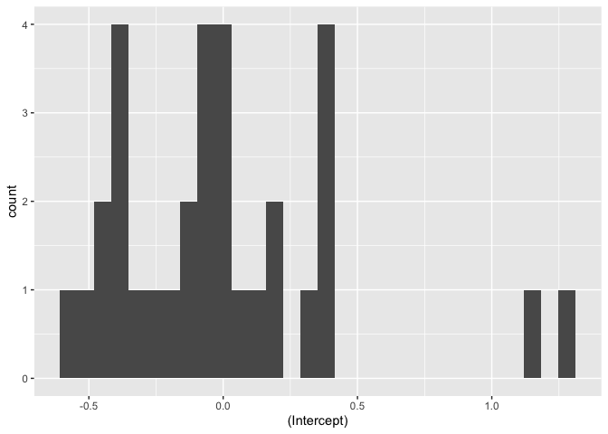
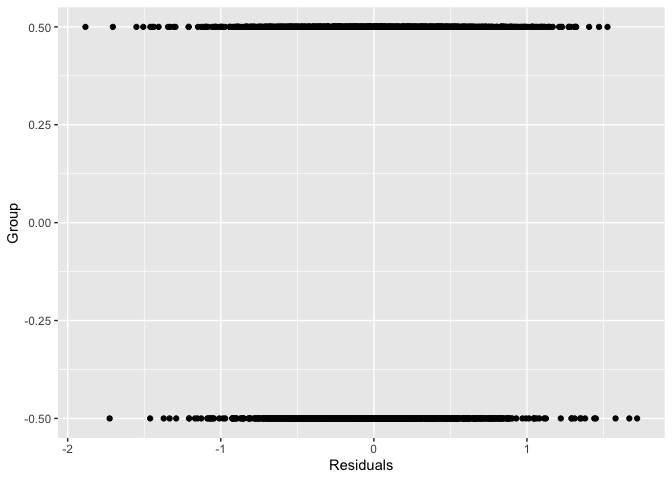
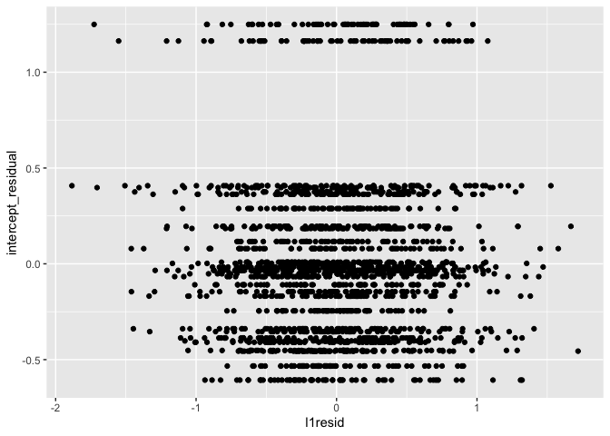
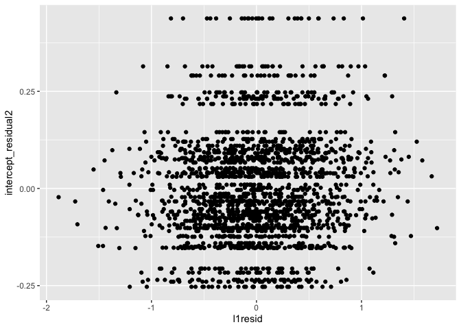
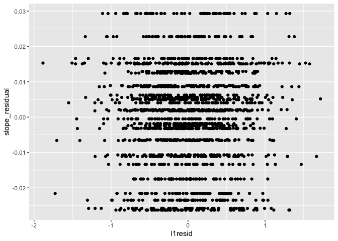
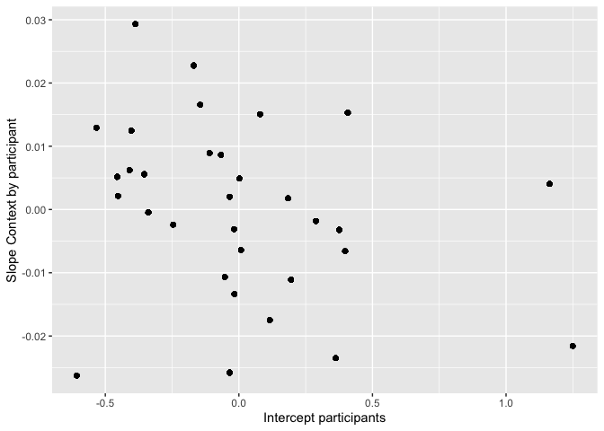
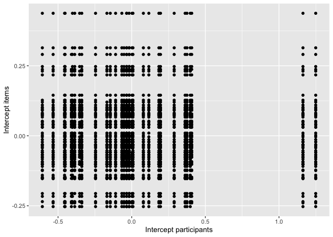
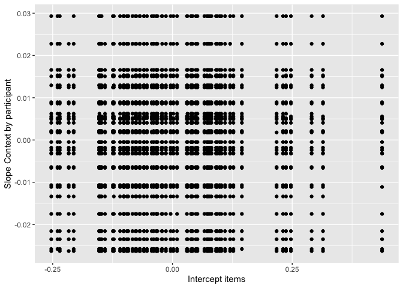

Final\_Project\_markdown
================
Pauline Palma
03/04/2020

    ## 
    ## Attaching package: 'dplyr'

    ## The following objects are masked from 'package:stats':
    ## 
    ##     filter, lag

    ## The following objects are masked from 'package:base':
    ## 
    ##     intersect, setdiff, setequal, union

    ## Loading required package: Matrix

    ## 
    ## Attaching package: 'lmerTest'

    ## The following object is masked from 'package:lme4':
    ## 
    ##     lmer

    ## The following object is masked from 'package:stats':
    ## 
    ##     step

    ## ── Attaching packages ─────────────────────────────────────────────────── tidyverse 1.3.0 ──

    ## ✓ ggplot2 3.3.0     ✓ purrr   0.3.3
    ## ✓ tibble  3.0.0     ✓ stringr 1.4.0
    ## ✓ tidyr   1.0.2     ✓ forcats 0.5.0
    ## ✓ readr   1.3.1

    ## ── Conflicts ────────────────────────────────────────────────────── tidyverse_conflicts() ──
    ## x tidyr::expand() masks Matrix::expand()
    ## x dplyr::filter() masks stats::filter()
    ## x dplyr::lag()    masks stats::lag()
    ## x tidyr::pack()   masks Matrix::pack()
    ## x tidyr::unpack() masks Matrix::unpack()

    ## Loading required package: carData

    ## Use the command
    ##     lattice::trellis.par.set(effectsTheme())
    ##   to customize lattice options for effects plots.
    ## See ?effectsTheme for details.

1.  Description of the learning objectives a demo of MLM in a
    cross-classified data structure Describe what it is, why it is
    important to know about that (super important in a repeated measure
    design)

2.  Research questions

<!-- end list -->

1)  do bilingual older adults process ambiguous words differently when
    they are embedded in sentences that clarify the meaning or not? -\>
    Model 2 (why would older bilingual adults differ from younger ones?)
2)  Does native language modulate the processing of ambiguous words? -\>
    Model 3
3)  Does native language impact the processing of ambiguous words
    regardless of sentence context? -\> Model 3

<!-- end list -->

3.  Description of the variables and coding scheme

<!-- end list -->

``` r
PSYC746_final <- read.csv("PSYC746_final.csv")
```

4.  Descriptive
    stats

<!-- end list -->

``` r
summary(PSYC746_final)
```

    ##       X.1               X           Trial_order       Subject     
    ##  Min.   :   1.0   Min.   :   1.0   Min.   : 1.00   Min.   : 1.00  
    ##  1st Qu.: 497.8   1st Qu.: 497.8   1st Qu.:17.00   1st Qu.: 8.00  
    ##  Median : 994.5   Median : 994.5   Median :33.00   Median :16.00  
    ##  Mean   : 994.5   Mean   : 994.5   Mean   :32.73   Mean   :16.42  
    ##  3rd Qu.:1491.2   3rd Qu.:1491.2   3rd Qu.:49.00   3rd Qu.:24.25  
    ##  Max.   :1988.0   Max.   :1988.0   Max.   :79.00   Max.   :32.00  
    ##                                                                   
    ##       ITEM        Condition_nb   TRT_beginning   TRT_modifier   
    ##  Min.   : 1.00   Min.   :1.000   Min.   : 118   Min.   : 101.0  
    ##  1st Qu.:16.00   1st Qu.:2.000   1st Qu.: 591   1st Qu.: 270.0  
    ##  Median :32.00   Median :3.000   Median : 982   Median : 453.0  
    ##  Mean   :32.42   Mean   :2.507   Mean   :1213   Mean   : 630.7  
    ##  3rd Qu.:48.00   3rd Qu.:4.000   3rd Qu.:1597   3rd Qu.: 785.0  
    ##  Max.   :64.00   Max.   :4.000   Max.   :9029   Max.   :5141.0  
    ##                                  NA's   :23     NA's   :314     
    ##    TRT_target        TRT_end           R5                        Condition  
    ##  Min.   : 101.0   Min.   : 485   Min.   : 151.0   Bare-dominant       :498  
    ##  1st Qu.: 294.0   1st Qu.:1988   1st Qu.: 218.0   Bare-subordinate    :501  
    ##  Median : 479.5   Median :2606   Median : 261.0   Modifier-dominant   :493  
    ##  Mean   : 666.3   Mean   :2965   Mean   : 454.3   Modifier-subordinate:496  
    ##  3rd Qu.: 786.0   3rd Qu.:3477   3rd Qu.: 558.0                             
    ##  Max.   :5215.0   Max.   :9758   Max.   :1346.0                             
    ##                   NA's   :30     NA's   :1979                               
    ##         Group          Context               WordType         Dominance  
    ##  English_L1: 818   Bare    :999   Cognate Homonym:999   Dominant   :991  
    ##  French_L1 :1170   Modifier:989   English Homonym:989   Subordinate:997  
    ##                                                                          
    ##                                                                          
    ##                                                                          
    ##                                                                          
    ##                                                                          
    ##  log_TRT_target    Group_dev         WordType_dev       Dominance_dev      
    ##  Min.   :4.615   Min.   :-0.50000   Min.   :-0.500000   Min.   :-0.500000  
    ##  1st Qu.:5.684   1st Qu.:-0.50000   1st Qu.:-0.500000   1st Qu.:-0.500000  
    ##  Median :6.173   Median : 0.50000   Median : 0.500000   Median : 0.500000  
    ##  Mean   :6.225   Mean   : 0.08853   Mean   : 0.002515   Mean   : 0.001509  
    ##  3rd Qu.:6.667   3rd Qu.: 0.50000   3rd Qu.: 0.500000   3rd Qu.: 0.500000  
    ##  Max.   :8.559   Max.   : 0.50000   Max.   : 0.500000   Max.   : 0.500000  
    ##                                                                            
    ##   Context_dev       
    ##  Min.   :-0.500000  
    ##  1st Qu.:-0.500000  
    ##  Median :-0.500000  
    ##  Mean   :-0.002515  
    ##  3rd Qu.: 0.500000  
    ##  Max.   : 0.500000  
    ## 

``` r
length(unique(PSYC746_final$Subject))
```

    ## [1] 32

``` r
length(unique(PSYC746_final$ITEM))
```

    ## [1] 64

Functional form \*replace all of these plots with bar plots, more
readable…

Plot relationship
predictors-DV

``` r
PSYC746_final %>% ggplot(mapping = aes(x = Context, y = log_TRT_target)) +
  geom_point() +
  facet_wrap(~Group)
```

<!-- -->

Correlation predictors-DV

``` r
PSYC746_final %>% 
  select(log_TRT_target, Group_dev, Context_dev) %>%
  cor()
```

    ##                log_TRT_target    Group_dev  Context_dev
    ## log_TRT_target      1.0000000  0.204573603 -0.138301158
    ## Group_dev           0.2045736  1.000000000 -0.002161634
    ## Context_dev        -0.1383012 -0.002161634  1.000000000

.20 correlation between Group and log TRT -.14 correlation between
Context and log TRT

Grid scatterplots predictors-DV Context-participants

``` r
PSYC746_final %>% 
  ggplot() +
  geom_point(mapping = aes(x = Context_dev, y = log_TRT_target)) +
  facet_wrap(~Subject)
```

<!-- -->
Most participants follow the expected pattern, but not all (Participant
19 for example)

Context-items

``` r
PSYC746_final %>% 
  ggplot() +
  geom_point(mapping = aes(x = Context_dev, y = log_TRT_target)) +
  facet_wrap(~ITEM)
```

<!-- -->
Most items follow the expected pattern, but not all (item 2, item 50 for
example)

Group-items

``` r
PSYC746_final %>% 
  ggplot() +
  geom_point(mapping = aes(x = Group_dev, y = log_TRT_target)) +
  facet_wrap(~ITEM)
```

<!-- -->
Pattern is unclear–it looks like some items were read faster by L1
English, but not all

Plot with regression line Context by participant

``` r
PSYC746_final %>% 
  group_by(Subject) %>% 
ggplot(mapping = aes(x = Context_dev, y = log_TRT_target, colour = factor(Subject))) +
  geom_point(show.legend = FALSE) +
  geom_smooth(method = lm, se = FALSE, show.legend = FALSE)
```

    ## `geom_smooth()` using formula 'y ~ x'

<!-- -->

Context by item

``` r
PSYC746_final %>% 
  group_by(ITEM) %>% 
ggplot(mapping = aes(x = Context_dev, y = log_TRT_target, colour = factor(ITEM))) +
  geom_point(show.legend = FALSE) +
  geom_smooth(method = lm, se = FALSE, show.legend = FALSE)
```

    ## `geom_smooth()` using formula 'y ~ x'

<!-- -->

Group by item

``` r
PSYC746_final %>% 
  group_by(ITEM) %>% 
ggplot(mapping = aes(x = Group_dev, y = log_TRT_target, colour = factor(ITEM))) +
  geom_point(show.legend = FALSE) +
  geom_smooth(method = lm, se = FALSE, show.legend = FALSE)
```

    ## `geom_smooth()` using formula 'y ~ x'

<!-- -->

5.  Models

<!-- end list -->

1.  Model 1
(null)

<!-- end list -->

``` r
Null = lmer(log_TRT_target ~ 1+(1|Subject) + (1|ITEM), data=PSYC746_final, REML = T)
summary(Null)
```

    ## Linear mixed model fit by REML. t-tests use Satterthwaite's method [
    ## lmerModLmerTest]
    ## Formula: log_TRT_target ~ 1 + (1 | Subject) + (1 | ITEM)
    ##    Data: PSYC746_final
    ## 
    ## REML criterion at convergence: 3298.2
    ## 
    ## Scaled residuals: 
    ##     Min      1Q  Median      3Q     Max 
    ## -3.7257 -0.6292 -0.0159  0.6316  3.4981 
    ## 
    ## Random effects:
    ##  Groups   Name        Variance Std.Dev.
    ##  ITEM     (Intercept) 0.02596  0.1611  
    ##  Subject  (Intercept) 0.20575  0.4536  
    ##  Residual             0.27660  0.5259  
    ## Number of obs: 1988, groups:  ITEM, 64; Subject, 32
    ## 
    ## Fixed effects:
    ##             Estimate Std. Error       df t value            Pr(>|t|)    
    ## (Intercept)  6.22055    0.08351 34.84286   74.48 <0.0000000000000002 ***
    ## ---
    ## Signif. codes:  0 '***' 0.001 '**' 0.01 '*' 0.05 '.' 0.1 ' ' 1

Interpretation:

ICC calculation

According to Carson & Beeson (2013, see also Locker et al., 2007), one
should calculate the ICC in that cross-classified data structure by
dividing the random effect (by participant or by items) by the total
variance (by participant + by item + residuals)

``` r
(0.02596)/(0.02596+0.20575+0.27660)
```

    ## [1] 0.0510712

ICC by item = 5.11% total variance

``` r
(0.20575)/(0.20575+0.02596+0.27660)
```

    ## [1] 0.4047727

ICC by participant = 40.48% total variance

DEFF by participants

Calculate the mean number of observation per participant

``` r
x = as.data.frame(table(PSYC746_final$Subject))
mean(x$Freq)
```

    ## [1] 62.125

Mean number of observations per participant = 62.125

``` r
DEFF = 1+(62.125-1)*0.4047727
```

DEFF participants = 25.742

Effective sample size

``` r
32/25.742
```

    ## [1] 1.243105

Effective sample size = 1.243

``` r
DEFT = sqrt(DEFF)
```

DEFT participants = 5.074 SE are 5.105 times larger than estimated

DEFF by items Calculate the mean number of observations per item

``` r
x = as.data.frame(table(PSYC746_final$ITEM))
mean(x$Freq)
```

    ## [1] 31.0625

Mean number of observations per item = 31.063

``` r
DEFF2 = 1+0.0510712*(31.063-1)
```

DEFF items = 2.535

``` r
64/2.535
```

    ## [1] 25.24655

Effective sample size = 25.247

``` r
DEFT2 = sqrt(DEFF2)
```

DEFT items = 1.592 SE are 1.592 times larger than estimated

The use of a MLM is warranted by the ICC and the DEFF.

2.  Model 2

<!-- end list -->

``` r
Model2 = lmer(log_TRT_target ~ Context_dev +
                (1|Subject) + 
                (1|ITEM), data=PSYC746_final, REML = T)
summary(Model2)
```

    ## Linear mixed model fit by REML. t-tests use Satterthwaite's method [
    ## lmerModLmerTest]
    ## Formula: log_TRT_target ~ Context_dev + (1 | Subject) + (1 | ITEM)
    ##    Data: PSYC746_final
    ## 
    ## REML criterion at convergence: 3237.2
    ## 
    ## Scaled residuals: 
    ##     Min      1Q  Median      3Q     Max 
    ## -3.5837 -0.6392 -0.0200  0.6415  3.3714 
    ## 
    ## Random effects:
    ##  Groups   Name        Variance Std.Dev.
    ##  ITEM     (Intercept) 0.02621  0.1619  
    ##  Subject  (Intercept) 0.20535  0.4532  
    ##  Residual             0.26718  0.5169  
    ## Number of obs: 1988, groups:  ITEM, 64; Subject, 32
    ## 
    ## Fixed effects:
    ##               Estimate Std. Error         df t value             Pr(>|t|)    
    ## (Intercept)    6.22001    0.08343   34.89361   74.55 < 0.0000000000000002 ***
    ## Context_dev   -0.19192    0.02329 1901.90001   -8.24 0.000000000000000317 ***
    ## ---
    ## Signif. codes:  0 '***' 0.001 '**' 0.01 '*' 0.05 '.' 0.1 ' ' 1
    ## 
    ## Correlation of Fixed Effects:
    ##             (Intr)
    ## Context_dev 0.001

Interpretation:

Model comparison Deviance

``` r
3298.2-3237.2
```

    ## [1] 61

Model 2 is significantly better than the null model (X2(1) = 61, p
\<.0001)

``` r
logLik(Model2) 
```

    ## 'log Lik.' -1618.578 (df=5)

``` r
confint(Model2, oldNames = FALSE) 
```

    ## Computing profile confidence intervals ...

    ##                             2.5 %     97.5 %
    ## sd_(Intercept)|ITEM     0.1278619  0.2044899
    ## sd_(Intercept)|Subject  0.3536449  0.5853164
    ## sigma                   0.5007293  0.5336756
    ## (Intercept)             6.0543421  6.3856671
    ## Context_dev            -0.2375801 -0.1462574

``` r
anova(Null, Model2, refit = FALSE)
```

    ## Data: PSYC746_final
    ## Models:
    ## Null: log_TRT_target ~ 1 + (1 | Subject) + (1 | ITEM)
    ## Model2: log_TRT_target ~ Context_dev + (1 | Subject) + (1 | ITEM)
    ##        Df    AIC    BIC  logLik deviance  Chisq Chi Df           Pr(>Chisq)    
    ## Null    4 3306.2 3328.6 -1649.1   3298.2                                       
    ## Model2  5 3247.2 3275.1 -1618.6   3237.2 61.064      1 0.000000000000005525 ***
    ## ---
    ## Signif. codes:  0 '***' 0.001 '**' 0.01 '*' 0.05 '.' 0.1 ' ' 1

This confirms that Model 2 has better fit than the null model

Difference in residuals

``` r
tau2change_p = 0.20575-0.20535
```

.0004

``` r
tau2change_i = 0.02596-0.02621
```

\-.0002

``` r
sigma2change = 0.27660-0.26718
```

.0094

Adding this predictor does not really impact the residuals

``` r
L1_var_reduction <- sigma2change / 0.27660
```

.034

``` r
L2_var_reduction_p <- tau2change_p/0.20575
```

.002

``` r
L2_var_reduction_i <- tau2change_i/0.02596
```

\-.010

Random variance not really reduced

Conditional ICC

``` r
conditionalICC_p = 0.20535/ (0.20535 + 0.02621+0.27660)
conditionalICC_i = 0.02621 / (0.02621 + 0.20535+ 0.27660)
```

40.41% of the variance is due to variability between subjects 5.16% of
the variance is due to variability between items

95% plausible values range for intercepts–How much do means vary across
participants?

``` r
SDx2 <- (2*(sqrt(0.20535)))
Upper_range <- 6.22001 + SDx2
lower_range <- 6.22001 - SDx2
```

5.314-7.126

95% plausible values range for intercepts–How much do means vary across
items?

``` r
SDx2 <- (2*(sqrt(0.02621)))
Upper_range <- 6.22001 + SDx2
lower_range <- 6.22001 - SDx2
```

5.896-6.544

3.  Model 3

<!-- end list -->

``` r
Model3 = lmer(log_TRT_target ~ Context_dev*Group_dev+
                (1+Context_dev||Subject) + 
                (1|ITEM), data=PSYC746_final, REML = T)
summary(Model3)
```

    ## Linear mixed model fit by REML. t-tests use Satterthwaite's method [
    ## lmerModLmerTest]
    ## Formula: log_TRT_target ~ Context_dev * Group_dev + (1 + Context_dev ||  
    ##     Subject) + (1 | ITEM)
    ##    Data: PSYC746_final
    ## 
    ## REML criterion at convergence: 3235.6
    ## 
    ## Scaled residuals: 
    ##     Min      1Q  Median      3Q     Max 
    ## -3.6515 -0.6410 -0.0236  0.6468  3.3326 
    ## 
    ## Random effects:
    ##  Groups    Name        Variance Std.Dev.
    ##  ITEM      (Intercept) 0.026274 0.1621  
    ##  Subject   Context_dev 0.001971 0.0444  
    ##  Subject.1 (Intercept) 0.190874 0.4369  
    ##  Residual              0.266246 0.5160  
    ## Number of obs: 1988, groups:  ITEM, 64; Subject, 32
    ## 
    ## Fixed effects:
    ##                       Estimate Std. Error       df t value             Pr(>|t|)
    ## (Intercept)            6.19294    0.08204 33.91029  75.483 < 0.0000000000000002
    ## Context_dev           -0.20025    0.02493 29.17057  -8.033        0.00000000707
    ## Group_dev              0.28966    0.15901 30.00768   1.822               0.0785
    ## Context_dev:Group_dev  0.09712    0.04972 28.96251   1.953               0.0605
    ##                          
    ## (Intercept)           ***
    ## Context_dev           ***
    ## Group_dev             .  
    ## Context_dev:Group_dev .  
    ## ---
    ## Signif. codes:  0 '***' 0.001 '**' 0.01 '*' 0.05 '.' 0.1 ' ' 1
    ## 
    ## Correlation of Fixed Effects:
    ##             (Intr) Cntxt_ Grp_dv
    ## Context_dev  0.001              
    ## Group_dev   -0.181  0.000       
    ## Cntxt_dv:G_  0.000 -0.175  0.001

Interpretation:

Visualization of the interaction (not significant)

``` r
ef <- as.data.frame(Effect(c("Context_dev", "Group_dev"), Model3))
ef
```

    ##    Context_dev Group_dev      fit         se    lower    upper
    ## 1         -0.5      -0.5 6.172514 0.12562355 5.926146 6.418882
    ## 2         -0.2      -0.5 6.097872 0.12440448 5.853895 6.341849
    ## 3          0.0      -0.5 6.048111 0.12417284 5.804588 6.291634
    ## 4          0.2      -0.5 5.998350 0.12440983 5.754362 6.242338
    ## 5          0.5      -0.5 5.923709 0.12563677 5.677315 6.170102
    ## 6         -0.5      -0.2 6.244843 0.09428648 6.059932 6.429754
    ## 7         -0.2      -0.2 6.178942 0.09338712 5.995795 6.362089
    ## 8          0.0      -0.2 6.135008 0.09321659 5.952195 6.317821
    ## 9          0.2      -0.2 6.091074 0.09339204 5.907917 6.274231
    ## 10         0.5      -0.2 6.025173 0.09429864 5.840238 6.210108
    ## 11        -0.5       0.0 6.293063 0.08297766 6.130330 6.455795
    ## 12        -0.2       0.0 6.232989 0.08219230 6.071797 6.394181
    ## 13         0.0       0.0 6.192940 0.08204413 6.032038 6.353841
    ## 14         0.2       0.0 6.152890 0.08219865 5.991685 6.314095
    ## 15         0.5       0.0 6.092816 0.08299339 5.930053 6.255580
    ## 16        -0.5       0.2 6.341283 0.08338049 6.177760 6.504805
    ## 17        -0.2       0.2 6.287036 0.08258552 6.125072 6.448999
    ## 18         0.0       0.2 6.250871 0.08243646 6.089200 6.412542
    ## 19         0.2       0.2 6.214706 0.08259455 6.052725 6.376687
    ## 20         0.5       0.2 6.160459 0.08340285 5.996893 6.324026
    ## 21        -0.5       0.5 6.413612 0.10458102 6.208512 6.618712
    ## 22        -0.2       0.5 6.368106 0.10355920 6.165010 6.571202
    ## 23         0.0       0.5 6.337768 0.10336821 6.135046 6.540490
    ## 24         0.2       0.5 6.307430 0.10357255 6.104308 6.510553
    ## 25         0.5       0.5 6.261924 0.10461406 6.056759 6.467089

``` r
ef$Context = ifelse(ef$Context_dev == -0.5, "Bare", ifelse(ef$Context_dev == 0.5, "Modifier", "HDUEHEIQU"))
ef$Group = ifelse(ef$Group_dev == -0.5, "L1 English", ifelse(ef$Group_dev == 0.5, "L1 French", "HDUEHEIQU"))
ef = subset(ef, Context != "HDUEHEIQU" & Group != "HDUEHEIQU")

ggplot(ef, aes(x=Context, y=fit)) +
  geom_bar(stat="identity", position="dodge", aes(fill=Context)) +
  scale_fill_manual(values = wes_palette("GrandBudapest2"))+
  geom_errorbar(aes(ymin=fit-se, ymax=fit+se), width=.3, size = .6) +
  labs(y="TRT of the target ambiguous word\n(log ms, fitted)", x = "Prior sentence context", fill="") +
  facet_wrap(~Group)+
  coord_cartesian(ylim=c(4,7)) +
  theme_apa()+
  theme_bw(base_size = 20) +
  theme(legend.position = "none", axis.text.x = element_text(size = 16), 
        axis.text.y = element_text(size = 16), axis.title.x= element_text(size = 16),
        axis.title.y = element_text(size = 16), strip.text.x = element_text(size = 16),
        panel.grid.major = element_blank(), panel.grid.minor = element_blank(), panel.border = element_rect(colour = "black", fill=NA, size=1))
```

<!-- -->

Model comparison

``` r
logLik(Model3) 
```

    ## 'log Lik.' -1617.816 (df=8)

``` r
confint(Model3, oldNames = FALSE) 
```

    ## Computing profile confidence intervals ...

    ##                                 2.5 %     97.5 %
    ## sd_(Intercept)|ITEM     0.12801983585  0.2046176
    ## sd_Context_dev|Subject  0.00000000000  0.1166254
    ## sd_(Intercept)|Subject  0.33507168177  0.5552452
    ## sigma                   0.49984998818  0.5330104
    ## (Intercept)             6.03254634210  6.3533525
    ## Context_dev            -0.24896181007 -0.1514471
    ## Group_dev              -0.02176418721  0.6009623
    ## Context_dev:Group_dev  -0.00006391184  0.1944441

Log likelihood model 2 = -1618.578 vs. model 3 = -1617.816. So model 2
(simpler) is better (i.e., log likelihood is more negative) Profile
confidence interval for group, context\*group, and for the random slope
for context include 0. So all the stuff we added is probably not
increasing the fit.

Deviance

``` r
3237.2-3235.6
```

    ## [1] 1.6

Model 3 is not significantly better in terms of fit than model 2 (X2(3)
= 1.6, p \> .05)

``` r
anova(Model2, Model3, refit = FALSE)
```

    ## Data: PSYC746_final
    ## Models:
    ## Model2: log_TRT_target ~ Context_dev + (1 | Subject) + (1 | ITEM)
    ## Model3: log_TRT_target ~ Context_dev * Group_dev + (1 + Context_dev || 
    ## Model3:     Subject) + (1 | ITEM)
    ##        Df    AIC    BIC  logLik deviance  Chisq Chi Df Pr(>Chisq)
    ## Model2  5 3247.2 3275.1 -1618.6   3237.2                         
    ## Model3  8 3251.6 3296.4 -1617.8   3235.6 1.5249      3     0.6765

This confirms that Model 2 has better fit than the null model

Difference in residuals

``` r
tau2change_p = 0.20535-0.190874
```

.014

``` r
tau2change_i = 0.02621-0.026274
```

\-.000

``` r
sigma2change = 0.26718-0.266246
```

.001

Adding this predictor does not really impact the residuals

``` r
L1_var_reduction <- sigma2change / 0.26718
```

.003

``` r
L2_var_reduction_p <- tau2change_p/0.20535
```

.070

``` r
L2_var_reduction_i <- tau2change_i/0.02621
```

\-.002

Random variance by participants is slightly reduced

Conditional ICC

``` r
conditionalICC_p = 0.190874/ (0.190874 + 0.026274+0.266246)
conditionalICC_i = 0.026274 / (0.026274 + 0.190874+ 0.266246)
```

39.49% of the variance is due to variability between subjects 5.44% of
the variance is due to variability between items

95% plausible values range for intercepts–How much do means vary across
participants?

``` r
SDx2 <- (2*(sqrt(0.190874)))
Upper_range <- 6.19294 + SDx2
lower_range <- 6.19294 - SDx2
```

5.319-7.067

95% plausible values range for intercepts–How much do means vary across
items?

``` r
SDx2 <- (2*(sqrt(0.026274)))
Upper_range <- 6.19294 + SDx2
lower_range <- 6.19294 - SDx2
```

5.869-6.517

ASSUMPTION CHECKS

Distribution of L1 residuals

``` r
l1_residuals <- tibble::enframe(residuals(Model3))
PSYC746_final <- PSYC746_final %>% 
  bind_cols(l1_residuals) %>% 
  select(-name) %>% 
  rename(l1resid = value)
```

    ## `stat_bin()` using `bins = 30`. Pick better value with `binwidth`.

<!-- -->

Distribution of L2 residuals

``` r
par(mfrow=c(1,3))

PSYC746_finalByParticRanef <- ranef(Model3)$Subject[['(Intercept)']]
qqnorm(PSYC746_finalByParticRanef,  main = "participant intercepts") #2 weirdos
qqline(PSYC746_finalByParticRanef)

PSYC746_finalByParticRanef_slope <- ranef(Model3)$Subject[['Context_dev']]
qqnorm(PSYC746_finalByParticRanef_slope,  main = "participant slopes") #OK
qqline(PSYC746_finalByParticRanef_slope)

PSYC746_finalByItemRanef <- ranef(Model3)$ITEM[['(Intercept)']]
qqnorm(PSYC746_finalByItemRanef,  main = "item intercepts") #1 weirdo
qqline(PSYC746_finalByItemRanef)
```

<!-- -->

2 weird participants, 1 weird item

Summary statistics L2 residuals

``` r
summary(PSYC746_finalByParticRanef)
```

    ##     Min.  1st Qu.   Median     Mean  3rd Qu.     Max. 
    ## -0.60671 -0.34263 -0.03451  0.00000  0.18721  1.24930

``` r
summary(PSYC746_finalByParticRanef_slope)
```

    ##      Min.   1st Qu.    Median      Mean   3rd Qu.      Max. 
    ## -0.026279 -0.007621  0.001885  0.000000  0.008702  0.029309

``` r
summary(PSYC746_finalByItemRanef)
```

    ##     Min.  1st Qu.   Median     Mean  3rd Qu.     Max. 
    ## -0.25303 -0.09670 -0.02187  0.00000  0.07893  0.43761

mean of 0, which is great, but medians are not, so there is a hint of
nonnormality

Plot L2 residuals-participants
    (intercept)

    ## `stat_bin()` using `bins = 30`. Pick better value with `binwidth`.

<!-- -->

Plot L2 residuals - Items
    (intercept)

    ## `stat_bin()` using `bins = 30`. Pick better value with `binwidth`.

<!-- -->

Plot L2 residuals - Participants (slope)

``` r
l2_residuals_p %>% 
  ggplot(mapping = aes(x = Context_dev)) +
  geom_histogram()
```

    ## `stat_bin()` using `bins = 30`. Pick better value with `binwidth`.

<!-- -->

Flag outliers-participants
(intercept)

<!-- -->
Participant 29 and 8 are outliers

Flag outliers-items (intercept)
<!-- -->
Item 2 is an outlier (“axes”)

Flag outliers-participants (slope)

``` r
is_outlier <- function(x) {
  return(x < quantile(x, 0.25) - 1.5 * IQR(x) | x > quantile(x, 0.75) + 1.5 * IQR(x))
}

temp_int <- l2_residuals_p %>% 
  tibble::rownames_to_column(var="outlier") %>% 
  mutate(is_outlier = ifelse(is_outlier(`Context_dev`), `Context_dev`, as.numeric(NA)))
temp_int$outlier[which(is.na(temp_int$is_outlier))] <- as.numeric(NA)

ggplot(temp_int, aes(y = `(Intercept)`, x = 0)) +
  geom_boxplot()  +
  geom_text(aes(label = outlier), na.rm = TRUE, nudge_y = 0.2)
```

<!-- -->
No outlier flagged

As an aside, what if we removed these
outliers?

``` r
Model3bis <- update(Model3, . ~ ., data=filter(PSYC746_final, Subject != c(8, 29)))
summary(Model3bis)
```

    ## Linear mixed model fit by REML. t-tests use Satterthwaite's method [
    ## lmerModLmerTest]
    ## Formula: log_TRT_target ~ Context_dev + Group_dev + (1 | Subject) + (0 +  
    ##     Context_dev | Subject) + (1 | ITEM) + Context_dev:Group_dev
    ##    Data: filter(PSYC746_final, Subject != c(8, 29))
    ## 
    ## REML criterion at convergence: 3109.3
    ## 
    ## Scaled residuals: 
    ##     Min      1Q  Median      3Q     Max 
    ## -3.7157 -0.6420 -0.0290  0.6425  3.3544 
    ## 
    ## Random effects:
    ##  Groups    Name        Variance Std.Dev.
    ##  ITEM      (Intercept) 0.026040 0.16137 
    ##  Subject   Context_dev 0.002188 0.04678 
    ##  Subject.1 (Intercept) 0.190004 0.43589 
    ##  Residual              0.262496 0.51234 
    ## Number of obs: 1924, groups:  ITEM, 64; Subject, 32
    ## 
    ## Fixed effects:
    ##                       Estimate Std. Error       df t value             Pr(>|t|)
    ## (Intercept)            6.19333    0.08189 33.25045  75.629 < 0.0000000000000002
    ## Context_dev           -0.19320    0.02534 28.84832  -7.625         0.0000000216
    ## Group_dev              0.26808    0.15874 29.44744   1.689               0.1018
    ## Context_dev:Group_dev  0.09290    0.05056 28.53370   1.837               0.0766
    ##                          
    ## (Intercept)           ***
    ## Context_dev           ***
    ## Group_dev                
    ## Context_dev:Group_dev .  
    ## ---
    ## Signif. codes:  0 '***' 0.001 '**' 0.01 '*' 0.05 '.' 0.1 ' ' 1
    ## 
    ## Correlation of Fixed Effects:
    ##             (Intr) Cntxt_ Grp_dv
    ## Context_dev  0.001              
    ## Group_dev   -0.182  0.000       
    ## Cntxt_dv:G_  0.000 -0.178  0.001

Removing outlier participants does not drastically change the effects:
the effect of “Group”, which was borderline significant, is now at .10.
The interaction coefficient is still borderline significant. I tried
removing both participants and the item, the model would not converge
anymore (I do not have a lot of data to begin with). When I remove the
item…

``` r
Model3bis <- update(Model3, . ~ ., data=filter(PSYC746_final, ITEM != 2))
summary(Model3bis)
```

    ## Linear mixed model fit by REML. t-tests use Satterthwaite's method [
    ## lmerModLmerTest]
    ## Formula: log_TRT_target ~ Context_dev + Group_dev + (1 | Subject) + (0 +  
    ##     Context_dev | Subject) + (1 | ITEM) + Context_dev:Group_dev
    ##    Data: filter(PSYC746_final, ITEM != 2)
    ## 
    ## REML criterion at convergence: 3180.9
    ## 
    ## Scaled residuals: 
    ##     Min      1Q  Median      3Q     Max 
    ## -3.6333 -0.6499 -0.0262  0.6357  3.3092 
    ## 
    ## Random effects:
    ##  Groups    Name        Variance Std.Dev.
    ##  ITEM      (Intercept) 0.021298 0.14594 
    ##  Subject   Context_dev 0.002967 0.05447 
    ##  Subject.1 (Intercept) 0.189108 0.43487 
    ##  Residual              0.266163 0.51591 
    ## Number of obs: 1959, groups:  ITEM, 63; Subject, 32
    ## 
    ## Fixed effects:
    ##                       Estimate Std. Error       df t value             Pr(>|t|)
    ## (Intercept)            6.18389    0.08126 33.23636  76.098 < 0.0000000000000002
    ## Context_dev           -0.19988    0.02573 29.09311  -7.770         0.0000000141
    ## Group_dev              0.28870    0.15831 30.00544   1.824               0.0782
    ## Context_dev:Group_dev  0.09423    0.05132 28.88887   1.836               0.0766
    ##                          
    ## (Intercept)           ***
    ## Context_dev           ***
    ## Group_dev             .  
    ## Context_dev:Group_dev .  
    ## ---
    ## Signif. codes:  0 '***' 0.001 '**' 0.01 '*' 0.05 '.' 0.1 ' ' 1
    ## 
    ## Correlation of Fixed Effects:
    ##             (Intr) Cntxt_ Grp_dv
    ## Context_dev  0.001              
    ## Group_dev   -0.182  0.000       
    ## Cntxt_dv:G_  0.000 -0.176  0.001

No change to the effects

\!\!Relatedness\!\!

A. Relatedness of L2 predictors and L2 residuals Relatedness of L2
predictors (context) and L2 residuals (intercept participant)

``` r
l2_residuals_rowname_p <- rownames_to_column(l2_residuals_p) %>% 
  rename("Subject" = rowname) %>%
  mutate("Subject" = as.integer(Subject)) %>% 
  rename(L2resid_p = '(Intercept)') %>%
  rename(L2resid_slope = 'Context_dev') %>%
  as_tibble()

l2_mix <- merge(l2_residuals_rowname_p, PSYC746_final, by = "Subject")

l2_mix %>% ggplot(mapping = aes(x = L2resid_p, y = Context_dev)) +
  geom_point() +
  labs(x = "Residuals participants", y = "Context")
```

<!-- -->

``` r
cor.test(l2_mix$L2resid_p, l2_mix$Context_dev)
```

    ## 
    ##  Pearson's product-moment correlation
    ## 
    ## data:  l2_mix$L2resid_p and l2_mix$Context_dev
    ## t = -0.21112, df = 1986, p-value = 0.8328
    ## alternative hypothesis: true correlation is not equal to 0
    ## 95 percent confidence interval:
    ##  -0.04869021  0.03923392
    ## sample estimates:
    ##          cor 
    ## -0.004737297

No significant correlation L2 residuals-participant and Context

Relatedness of L2 predictors (group) and L2 residuals (intercept
participant)

``` r
l2_mix %>% ggplot(mapping = aes(x = L2resid_p, y = Group_dev)) +
  geom_point() +
  labs(x = "Residuals participants", y = "Group")
```

<!-- -->

``` r
cor.test(l2_mix$L2resid_p, l2_mix$Group_dev) 
```

    ## 
    ##  Pearson's product-moment correlation
    ## 
    ## data:  l2_mix$L2resid_p and l2_mix$Group_dev
    ## t = 0.29161, df = 1986, p-value = 0.7706
    ## alternative hypothesis: true correlation is not equal to 0
    ## 95 percent confidence interval:
    ##  -0.03743044  0.05049190
    ## sample estimates:
    ##         cor 
    ## 0.006543379

No significant correlation L2 residuals- intercept participant and Group

Relatedness of l2 predictor (context) and l2\_residuals (intercept
items)

``` r
l2_residuals_rowname_i <- rownames_to_column(l2_residuals_i) %>% 
  rename("ITEM" = rowname) %>%
  mutate("ITEM" = as.integer(ITEM)) %>% 
  rename(L2resid_i = '(Intercept)') %>%
  as_tibble()

l2_mix <- merge(l2_residuals_rowname_i, PSYC746_final, by = "ITEM")

l2_mix %>% ggplot(mapping = aes(x = L2resid_i, y = Context_dev)) +
  geom_point() +
  labs(x = "Residuals items", y = "Context")
```

<!-- -->

``` r
cor.test(l2_mix$L2resid_i, l2_mix$Context_dev) 
```

    ## 
    ##  Pearson's product-moment correlation
    ## 
    ## data:  l2_mix$L2resid_i and l2_mix$Context_dev
    ## t = 0.028594, df = 1986, p-value = 0.9772
    ## alternative hypothesis: true correlation is not equal to 0
    ## 95 percent confidence interval:
    ##  -0.04332264  0.04460342
    ## sample estimates:
    ##          cor 
    ## 0.0006416285

No significant correlation L2 residuals (intercept items) and context

Relatedness of L2 predictors (group) and L2 residuals (intercept items)

``` r
l2_mix %>% ggplot(mapping = aes(x = L2resid_i, y = Group_dev)) +
  geom_point() +
  labs(x = "Residuals items", y = "Group")
```

<!-- -->

``` r
cor.test(l2_mix$L2resid_i, l2_mix$Group_dev) 
```

    ## 
    ##  Pearson's product-moment correlation
    ## 
    ## data:  l2_mix$L2resid_i and l2_mix$Group_dev
    ## t = -0.088875, df = 1986, p-value = 0.9292
    ## alternative hypothesis: true correlation is not equal to 0
    ## 95 percent confidence interval:
    ##  -0.04595331  0.04197244
    ## sample estimates:
    ##          cor 
    ## -0.001994293

No significant correlation L2 residuals (intercept items) and group

Relatedness of L2 prediction (context) and L2\_residuals (slope context
participant)

``` r
l2_mix <- merge(l2_residuals_rowname_p, PSYC746_final, by = "Subject")
l2_mix %>% ggplot(mapping = aes(x = L2resid_slope, y = Context_dev)) +
  geom_point() +
  labs(x = "Residual slope by participants", y = "Context")
```

<!-- -->

``` r
cor.test(l2_mix$L2resid_slope, l2_mix$Context_dev)
```

    ## 
    ##  Pearson's product-moment correlation
    ## 
    ## data:  l2_mix$L2resid_slope and l2_mix$Context_dev
    ## t = 0.1376, df = 1986, p-value = 0.8906
    ## alternative hypothesis: true correlation is not equal to 0
    ## 95 percent confidence interval:
    ##  -0.04088090  0.04704436
    ## sample estimates:
    ##         cor 
    ## 0.003087701

No correlation L2 residuals (slope participants) and context

Relatedness of L2 predictor (group) and L2 residuals (slope context
participant)

``` r
l2_mix %>% ggplot(mapping = aes(x = L2resid_slope, y = Group_dev)) +
  geom_point() +
  labs(x = "Residual slope by participants", y = "Group")
```

<!-- -->

``` r
cor.test(l2_mix$L2resid_slope, l2_mix$Group_dev)
```

    ## 
    ##  Pearson's product-moment correlation
    ## 
    ## data:  l2_mix$L2resid_slope and l2_mix$Group_dev
    ## t = -0.18833, df = 1986, p-value = 0.8506
    ## alternative hypothesis: true correlation is not equal to 0
    ## 95 percent confidence interval:
    ##  -0.04817999  0.03974454
    ## sample estimates:
    ##          cor 
    ## -0.004225892

No correlation L2 residuals (slope participants) and group

B. Relatedness of L2 predictors and L1 residuals

Relatedness of L2 predictors (context) and L1 residuals

``` r
PSYC746_final %>% ggplot(mapping = aes(x = l1resid, y = Context_dev)) +
  geom_point() +
  labs(x = "Residuals", y = "Context")
```

<!-- -->

``` r
cor.test(PSYC746_final$l1resid, PSYC746_final$Context_dev) 
```

    ## 
    ##  Pearson's product-moment correlation
    ## 
    ## data:  PSYC746_final$l1resid and PSYC746_final$Context_dev
    ## t = 0.0000000000000028608, df = 1986, p-value = 1
    ## alternative hypothesis: true correlation is not equal to 0
    ## 95 percent confidence interval:
    ##  -0.04396305  0.04396305
    ## sample estimates:
    ##                       cor 
    ## 0.00000000000000006419341

No significant correlation

Relatedness of L2 predictors (group) and L1 residuals

``` r
PSYC746_final %>% ggplot(mapping = aes(x = l1resid, y = Group_dev)) +
  geom_point() +
  labs(x = "Residuals", y = "Group")
```

<!-- -->

``` r
cor.test(PSYC746_final$l1resid, PSYC746_final$Group_dev) 
```

    ## 
    ##  Pearson's product-moment correlation
    ## 
    ## data:  PSYC746_final$l1resid and PSYC746_final$Group_dev
    ## t = -0.00000000000010667, df = 1986, p-value = 1
    ## alternative hypothesis: true correlation is not equal to 0
    ## 95 percent confidence interval:
    ##  -0.04396305  0.04396305
    ## sample estimates:
    ##                      cor 
    ## -0.000000000000002393582

No significant correlation

C. Relatedness of L1 and L2 residuals Relatedness of l1\_residuals and
l2\_residuals (intercept participants)
<!-- -->

Again, 2 clear outliers

Relatedness of l1\_residuals and l2\_residuals (intercept
items)

    ## Joining, by = "ITEM"

<!-- -->

Relatedness of l1\_residuals and l2\_residuals (slope participants)
<!-- -->

D. Relatedness L2 residuals and L2 residuals

L2 intercept (participant)-L2 slope (participants)

``` r
l2_mix %>% ggplot(mapping = aes(x = L2resid_p, y = L2resid_slope)) +
  geom_point() +
  labs(x = "Intercept participants", y = "Slope Context by participant")
```

<!-- -->

``` r
cor.test(l2_mix$L2resid_p, l2_mix$L2resid_slope) 
```

    ## 
    ##  Pearson's product-moment correlation
    ## 
    ## data:  l2_mix$L2resid_p and l2_mix$L2resid_slope
    ## t = -13.706, df = 1986, p-value < 0.00000000000000022
    ## alternative hypothesis: true correlation is not equal to 0
    ## 95 percent confidence interval:
    ##  -0.3336094 -0.2532677
    ## sample estimates:
    ##        cor 
    ## -0.2939577

There is a moderate correlation (significant) \> the higher the mean
log\_TRT\_value for an individual, the smaller the effect of context for
this individual

L2 intercept (participant)-L2 intercept (item)

``` r
l2_mix2 <- merge(l2_mix, l2_residuals_rowname_i, by = "ITEM")
l2_mix2 %>% ggplot(mapping = aes(x = L2resid_p, y = L2resid_i)) +
  geom_point() +
  labs(x = "Intercept participants", y = "Intercept items")
```

<!-- -->

``` r
cor.test(l2_mix2$L2resid_p, l2_mix2$L2resid_i)
```

    ## 
    ##  Pearson's product-moment correlation
    ## 
    ## data:  l2_mix2$L2resid_p and l2_mix2$L2resid_i
    ## t = -0.081127, df = 1986, p-value = 0.9353
    ## alternative hypothesis: true correlation is not equal to 0
    ## 95 percent confidence interval:
    ##  -0.04577981  0.04214600
    ## sample estimates:
    ##          cor 
    ## -0.001820425

No correlation intercept participant-intercept item

L2 intercept (items)-L2 slope (participants)

``` r
l2_mix2 %>% ggplot(mapping = aes(x = L2resid_i, y = L2resid_slope)) +
  geom_point() +
  labs(x = "Intercept items", y = "Slope Context by participant")
```

<!-- -->

``` r
cor.test(l2_mix2$L2resid_i, l2_mix2$L2resid_slope) 
```

    ## 
    ##  Pearson's product-moment correlation
    ## 
    ## data:  l2_mix2$L2resid_i and l2_mix2$L2resid_slope
    ## t = 0.22506, df = 1986, p-value = 0.822
    ## alternative hypothesis: true correlation is not equal to 0
    ## 95 percent confidence interval:
    ##  -0.03892146  0.04900240
    ## sample estimates:
    ##         cor 
    ## 0.005050227

No correlation intercept items-random slope Context by participant
