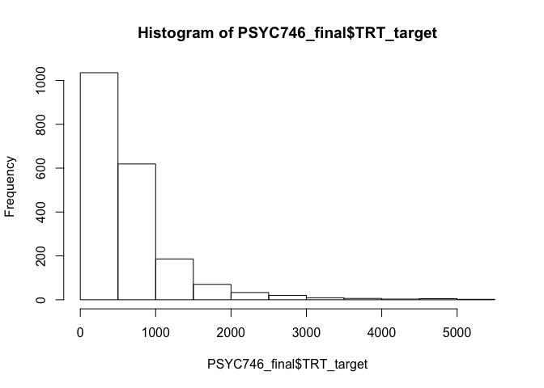
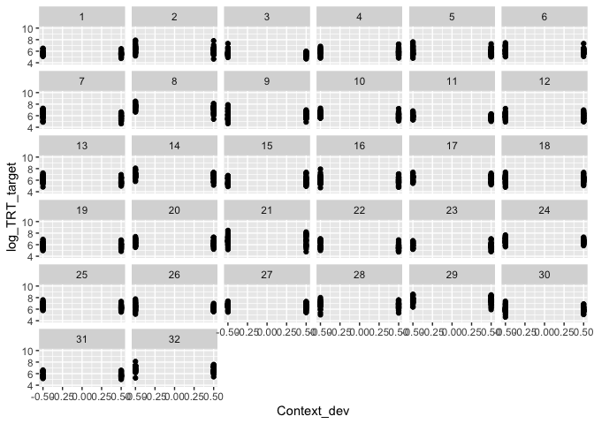
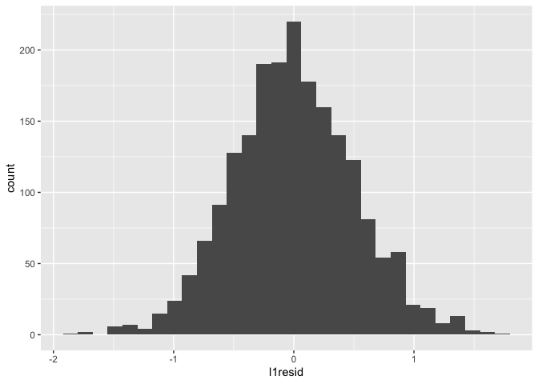
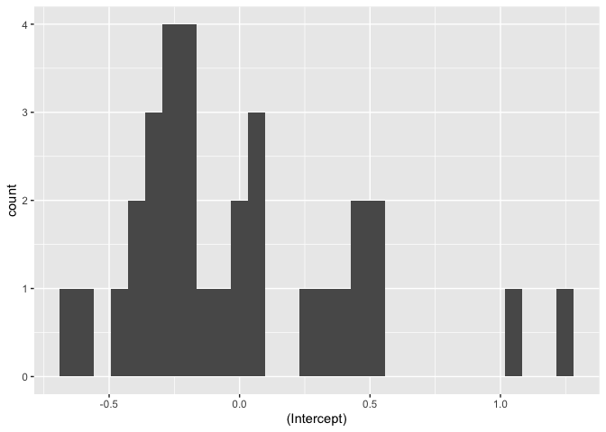
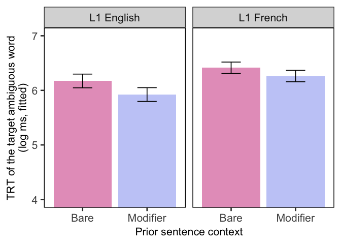
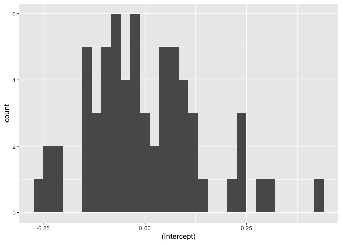
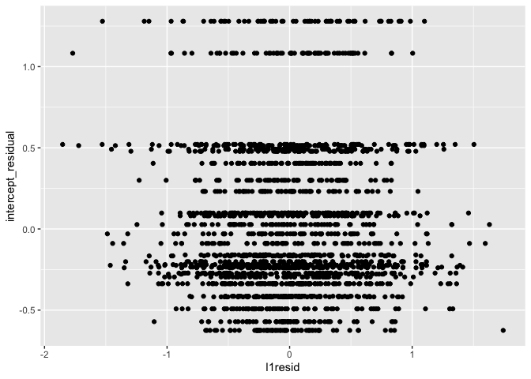

Final\_Project\_markdown
================
Pauline Palma
03/04/2020

    ## 
    ## Attaching package: 'dplyr'

    ## The following objects are masked from 'package:stats':
    ## 
    ##     filter, lag

    ## The following objects are masked from 'package:base':
    ## 
    ##     intersect, setdiff, setequal, union

    ## Loading required package: Matrix

    ## 
    ## Attaching package: 'lmerTest'

    ## The following object is masked from 'package:lme4':
    ## 
    ##     lmer

    ## The following object is masked from 'package:stats':
    ## 
    ##     step

    ## ── Attaching packages ────────────────────────────────────────────────── tidyverse 1.3.0 ──

    ## ✓ ggplot2 3.3.0     ✓ purrr   0.3.3
    ## ✓ tibble  3.0.0     ✓ stringr 1.4.0
    ## ✓ tidyr   1.0.2     ✓ forcats 0.5.0
    ## ✓ readr   1.3.1

    ## ── Conflicts ───────────────────────────────────────────────────── tidyverse_conflicts() ──
    ## x tidyr::expand() masks Matrix::expand()
    ## x dplyr::filter() masks stats::filter()
    ## x dplyr::lag()    masks stats::lag()
    ## x tidyr::pack()   masks Matrix::pack()
    ## x tidyr::unpack() masks Matrix::unpack()

Data loading and preprocessing

``` r
PSYC746_final <- read.csv("trt.csv")
```

Remove trials where target was skipped (TRT = NA)

``` r
summary(PSYC746_final$TRT_target)
```

    ##    Min. 1st Qu.  Median    Mean 3rd Qu.    Max.    NA's 
    ##   101.0   294.0   479.5   666.3   786.0  5215.0      25

There are 25 skipped trials, which represents 1.24% of the data

``` r
PSYC746_final = PSYC746_final %>% filter(!is.na(TRT_target))
```

Histogram of the dependent variable (TRT)
<!-- -->
Heavily skewed: we need to transform it

``` r
PSYC746_final$log_TRT_target = log(PSYC746_final$TRT_target)
hist(PSYC746_final$log_TRT_target)
```

<!-- -->

Recode variable (effects coding)

I. Model 1
(null)

``` r
Null = lmer(log_TRT_target ~ 1+(1|Subject) + (1|ITEM), data=PSYC746_final, REML = T)
summary(Null)
```

    ## Linear mixed model fit by REML. t-tests use Satterthwaite's method [
    ## lmerModLmerTest]
    ## Formula: log_TRT_target ~ 1 + (1 | Subject) + (1 | ITEM)
    ##    Data: PSYC746_final
    ## 
    ## REML criterion at convergence: 3298.2
    ## 
    ## Scaled residuals: 
    ##     Min      1Q  Median      3Q     Max 
    ## -3.7257 -0.6292 -0.0159  0.6316  3.4981 
    ## 
    ## Random effects:
    ##  Groups   Name        Variance Std.Dev.
    ##  ITEM     (Intercept) 0.02596  0.1611  
    ##  Subject  (Intercept) 0.20575  0.4536  
    ##  Residual             0.27660  0.5259  
    ## Number of obs: 1988, groups:  ITEM, 64; Subject, 32
    ## 
    ## Fixed effects:
    ##             Estimate Std. Error       df t value            Pr(>|t|)    
    ## (Intercept)  6.22055    0.08351 34.84285   74.48 <0.0000000000000002 ***
    ## ---
    ## Signif. codes:  0 '***' 0.001 '**' 0.01 '*' 0.05 '.' 0.1 ' ' 1

ICC calculation

According to Carson & Beeson (2013, see also Locker et al., 2007), one
should calculate the ICC in that cross-classified data structure by
dividing the random effect (by participant or by items) by the total
variance (by participant + by item + residuals)

``` r
(0.02596)/(0.02596+0.20575+0.27660)
```

    ## [1] 0.0510712

ICC by item = 5.11% total variance

``` r
(0.20575)/(0.20575+0.02596+0.27660)
```

    ## [1] 0.4047727

ICC by participant = 40.48% total variance

DEFF by participants

Calculate the mean number of observation per participant

``` r
x = as.data.frame(table(PSYC746_final$Subject))
mean(x$Freq)
```

    ## [1] 62.125

Mean number of observations per participant = 62.125

``` r
DEFF = 1+(62.125-1)*0.4047727
```

DEFF participants = 25.742

Effective sample size

``` r
32/25.742
```

    ## [1] 1.243105

Effective sample size = 1.243

``` r
DEFT = sqrt(DEFF)
```

DEFT participants = 5.074 SE are 5.105 times larger than estimated

DEFF by items Calculate the mean number of observations per item

``` r
x = as.data.frame(table(PSYC746_final$ITEM))
mean(x$Freq)
```

    ## [1] 31.0625

Mean number of observations per item = 31.063

``` r
DEFF2 = 1+0.0510712*(31.063-1)
```

DEFF items = 2.535

``` r
64/2.535
```

    ## [1] 25.24655

Effective sample size = 25.247

``` r
DEFT2 = sqrt(DEFF2)
```

DEFT items = 1.592 SE are 1.592 times larger than estimated

2.  Model 2

<!-- end list -->

``` r
Model2 = lmer(log_TRT_target ~ Context_dev +
                (1|Subject) + 
                (1|ITEM), data=PSYC746_final, REML = T)
summary(Model2)
```

    ## Linear mixed model fit by REML. t-tests use Satterthwaite's method [
    ## lmerModLmerTest]
    ## Formula: log_TRT_target ~ Context_dev + (1 | Subject) + (1 | ITEM)
    ##    Data: PSYC746_final
    ## 
    ## REML criterion at convergence: 3237.2
    ## 
    ## Scaled residuals: 
    ##     Min      1Q  Median      3Q     Max 
    ## -3.5837 -0.6392 -0.0200  0.6415  3.3714 
    ## 
    ## Random effects:
    ##  Groups   Name        Variance Std.Dev.
    ##  ITEM     (Intercept) 0.02621  0.1619  
    ##  Subject  (Intercept) 0.20535  0.4532  
    ##  Residual             0.26718  0.5169  
    ## Number of obs: 1988, groups:  ITEM, 64; Subject, 32
    ## 
    ## Fixed effects:
    ##               Estimate Std. Error         df t value             Pr(>|t|)    
    ## (Intercept)    6.22001    0.08343   34.89361   74.55 < 0.0000000000000002 ***
    ## Context_dev   -0.19192    0.02329 1901.90001   -8.24 0.000000000000000317 ***
    ## ---
    ## Signif. codes:  0 '***' 0.001 '**' 0.01 '*' 0.05 '.' 0.1 ' ' 1
    ## 
    ## Correlation of Fixed Effects:
    ##             (Intr)
    ## Context_dev 0.001

Deviance

``` r
3298.2-3237.2
```

    ## [1] 61

Model 2 is significantly better than the null model (X2(1) = 61, p
\<.0001)

``` r
anova(Null, Model2)
```

    ## refitting model(s) with ML (instead of REML)

    ## Data: PSYC746_final
    ## Models:
    ## Null: log_TRT_target ~ 1 + (1 | Subject) + (1 | ITEM)
    ## Model2: log_TRT_target ~ Context_dev + (1 | Subject) + (1 | ITEM)
    ##        Df    AIC    BIC  logLik deviance  Chisq Chi Df            Pr(>Chisq)
    ## Null    4 3303.1 3325.5 -1647.5   3295.1                                    
    ## Model2  5 3238.3 3266.3 -1614.2   3228.3 66.748      1 0.0000000000000003086
    ##           
    ## Null      
    ## Model2 ***
    ## ---
    ## Signif. codes:  0 '***' 0.001 '**' 0.01 '*' 0.05 '.' 0.1 ' ' 1

This confirms that Model 2 has better fit than the null model

Difference in residuals

``` r
tau2change_p = 0.20575-0.20535
```

.0004

``` r
tau2change_i = 0.02596-0.02621
```

\-.0002

``` r
sigma2change = 0.27660-0.26718
```

.0094

Adding this predictor does not really impact the residuals

``` r
L1_var_reduction <- sigma2change / 0.27660
```

.034

``` r
L2_var_reduction_p <- tau2change_p/0.20575
```

.002

``` r
L2_var_reduction_i <- tau2change_i/0.02596
```

\-.010

Random variance not really reduced

Conditional ICC

``` r
conditionalICC_p = 0.20535/ (0.20535 + 0.02621+0.27660)
conditionalICC_i = 0.02621 / (0.02621 + 0.20535+ 0.27660)
```

40.41% of the variance is due to variability between subjects 5.16% of
the variance is due to variability between items

95% plausible values range for intercepts–How much do means vary across
participants?

``` r
SDx2 <- (2*(sqrt(0.20535)))
Upper_range <- 6.22001 + SDx2
lower_range <- 6.22001 - SDx2
```

5.314-7.126

95% plausible values range for intercepts–How much do means vary across
items?

``` r
SDx2 <- (2*(sqrt(0.02621)))
Upper_range <- 6.22001 + SDx2
lower_range <- 6.22001 - SDx2
```

5.896-6.544

Distribution of L1 residuals

``` r
#L1 residuals
l1_residuals <- tibble::enframe(residuals(Model2))
PSYC746_final <- PSYC746_final %>% 
  bind_cols(l1_residuals) %>% 
  select(-name) %>% 
  rename(l1resid = value)
```

    ## `stat_bin()` using `bins = 30`. Pick better value with `binwidth`.

<!-- -->

Distribution of L2 residuals

``` r
par(mfrow=c(1,2))

PSYC746_finalByParticRanef <- ranef(Model2)$Subject[['(Intercept)']]
qqnorm(PSYC746_finalByParticRanef,  main = "participant means") #2 weirdos
qqline(PSYC746_finalByParticRanef)

PSYC746_finalByItemRanef <- ranef(Model2)$ITEM[['(Intercept)']]
qqnorm(PSYC746_finalByItemRanef,  main = "item means") #1 weirdo
qqline(PSYC746_finalByItemRanef)
```

<!-- -->

2 weird participants, 1 weird item

Summary statistics L2 residuals

``` r
summary(PSYC746_finalByParticRanef)
```

    ##    Min. 1st Qu.  Median    Mean 3rd Qu.    Max. 
    ## -0.6249 -0.2824 -0.1630  0.0000  0.2485  1.2799

``` r
summary(PSYC746_finalByItemRanef)
```

    ##     Min.  1st Qu.   Median     Mean  3rd Qu.     Max. 
    ## -0.25186 -0.09742 -0.02263  0.00000  0.07786  0.43712

mean of 0, which is great, but median is different, so there is a hint
of nonnormality

Plot L2
    residuals-participants

    ## `stat_bin()` using `bins = 30`. Pick better value with `binwidth`.

<!-- -->

Plot L2 residuals -
    Items

    ## `stat_bin()` using `bins = 30`. Pick better value with `binwidth`.

<!-- -->

Flag
outliers-participants

<!-- -->
Participant 29 and 8 are outliers

Flag outliers-items
<!-- -->
Item 2 is an outlier

Relatedness of l2\_predictors and l2\_residuals
(participants)

    ## Joining, by = "Subject"

<!-- -->

Relatedness of l2\_predictors and l2\_residuals
(items)

    ## Joining, by = "ITEM"

<!-- -->

3.  Model 3

<!-- end list -->

``` r
Model3 = lmer(log_TRT_target ~ Context_dev*Group_dev+
                (1+Context_dev||Subject) + 
                (1|ITEM), data=PSYC746_final, REML = T)
summary(Model3)
```

    ## Linear mixed model fit by REML. t-tests use Satterthwaite's method [
    ## lmerModLmerTest]
    ## Formula: log_TRT_target ~ Context_dev * Group_dev + (1 + Context_dev ||  
    ##     Subject) + (1 | ITEM)
    ##    Data: PSYC746_final
    ## 
    ## REML criterion at convergence: 3235.6
    ## 
    ## Scaled residuals: 
    ##     Min      1Q  Median      3Q     Max 
    ## -3.6515 -0.6410 -0.0236  0.6468  3.3326 
    ## 
    ## Random effects:
    ##  Groups    Name        Variance Std.Dev.
    ##  ITEM      (Intercept) 0.026274 0.1621  
    ##  Subject   Context_dev 0.001971 0.0444  
    ##  Subject.1 (Intercept) 0.190874 0.4369  
    ##  Residual              0.266246 0.5160  
    ## Number of obs: 1988, groups:  ITEM, 64; Subject, 32
    ## 
    ## Fixed effects:
    ##                       Estimate Std. Error       df t value             Pr(>|t|)
    ## (Intercept)            6.19294    0.08204 33.91029  75.483 < 0.0000000000000002
    ## Context_dev           -0.20025    0.02493 29.17057  -8.033        0.00000000707
    ## Group_dev              0.28966    0.15901 30.00768   1.822               0.0785
    ## Context_dev:Group_dev  0.09712    0.04972 28.96251   1.953               0.0605
    ##                          
    ## (Intercept)           ***
    ## Context_dev           ***
    ## Group_dev             .  
    ## Context_dev:Group_dev .  
    ## ---
    ## Signif. codes:  0 '***' 0.001 '**' 0.01 '*' 0.05 '.' 0.1 ' ' 1
    ## 
    ## Correlation of Fixed Effects:
    ##             (Intr) Cntxt_ Grp_dv
    ## Context_dev  0.001              
    ## Group_dev   -0.181  0.000       
    ## Cntxt_dv:G_  0.000 -0.175  0.001
