PSYC 746-Final Project Demo
================
Pauline Palma
03/04/2020

# <span style="color: purple;"> 1. Description of the learning objectives</span>

Welcome to this demo\!

Today, you will learn about *cross-classified multilevel models*, a type
of model that is commonly found in various domains of experimental
psychology. We will use an example from psycholinguistics, where this
type of MLM is common.

  - What is a cross-classified multilevel model? A cross-classified
    multilevel model allows one to estimate the unique influence of two
    distinct Level 2 clusters. For instance, cross-classified MLM have
    been used in social psychology to assess variance in social
    impression formation (for a review, see Xie et al., 2018). In a
    social interaction, the impressions formed depend both on perceiver
    and on target characteristics, such as race and gender.
    Cross-classified MLM are especially useful there, as they allow for
    the partitioning of variance in impressions between perceivers and
    targets.

In psycholinguistics, cross-classified MLM allow researchers to estimate
the unique influence of individual participants and of individual items,
such as words or sentences. This is especially useful, as
psycholinguists are usually interested in both participants’
characteristics (e.g., their age, native language, etc.) and items’
characteristics (e.g., word length, frequency, etc.). A typical data
structure in psycholinguistics involves multiple observations (Level 1)
per participant (Level 2) and multiple observations per item (Level 2)
(Baayen, Davidson, & Bates, 2008). It is important to emphasize that the
two level 2 clusters are the primary units of interest for
psycholinguists, whereas level 1 units (observations/trials) are usually
not.

  - In the present demo, we try to model total reading time (an
    eye-tracking measure) as a function of participant’s native language
    and item’s sentence context. Cross-classified MLM allow us to
    account for participant variability (e.g., some participants might
    be slower than others) and for item variability (e.g., some words
    might be less familiar to the participants).

# <span style="color: purple;"> 2. Research context and questions</span>

Human languages are inherently ambiguous. An important aspect of
language processing is to make sense of this ambiguity. For example,
when presented with the homonym sage, one must choose between the
meaning ‘herb’ and the meaning ‘wise man’. Research on monolingual
readers has shown that these multiple meanings are activated in
parallel, which generates competition for meaning selection (e.g.,
Duffy, Kambe & Rayner, 2001; Rayner, Pacht & Duffy, 1994). Contextual
sentence has been shown to cue meaning selection, hence reducing reading
times on the ambiguous word (Rayner et al., 1994).

Importantly, reading speed is also impacted by participants’
characteristics. For instance, non-native readers usually exhibit slower
reading time compared to native readers, due to lower reading
proficiency (see Brysbaert, 2019, for a review). Older adults are also
slower compared to younger readers, due to slower processing speed (see
Rossi & Diaz, 2016, for a review). There is also some evidence that
contextual sentence specifically impacts reading times for ambiguous
words in non-native speakers (Palma, Whitford, & Titone, 2019; see also
Arêas da Luz Fontes & Schwartz, 2010, 2015; Schwartz, Yeh, & Shaw,
2008). However, it is unclear whether these effects extend to older
bilingual speakers, as participants in these studies were young adults
(18-35 years old). Because the effects of bilingualism have been shown
to change across the lifespan (Whitford & Titone, 2019), it would be
interesting to extend these results to older samples.

The goal with this project is to analyze how bilingual older adults (60+
years old) process ambiguous English words during natural reading. Older
bilingual adults read English sentences containing homonyms on a screen,
while their eye movements were recorded. Participants were either
French-English (reading in their second language) or English-French
(reading in their first language) older bilinguals. The homonyms were
embedded in sentences that either contained a modifier (e.g., adjective)
related to one of the two meanings (e.g., Mary liked the fresh sage), or
did not contain such a modifier (e.g., Mary liked the sage).

We constructed three models (including a null model) to answer four
specific research questions:

1)  Do bilingual older adults process ambiguous words differently when
    they are embedded in sentences that clarify their meaning or not?
    -\> Model 2
2)  Does the effect of context vary across participants? -\> Model 3
3)  Does native language modulate the processing of ambiguous words? -\>
    Model 3
4)  Does context impact the processing of ambiguous words regardless of
    native language? -\> Model 3

# <span style="color: purple;">3. Description of the variables</span>

``` r
PSYC746_final <- read.csv("PSYC746_final.csv")
```

``` r
summary(PSYC746_final)
```

    ##        X             Subject           ITEM       log_TRT_target 
    ##  Min.   :   1.0   Min.   : 1.00   Min.   : 1.00   Min.   :4.615  
    ##  1st Qu.: 497.8   1st Qu.: 8.00   1st Qu.:16.00   1st Qu.:5.684  
    ##  Median : 994.5   Median :16.00   Median :32.00   Median :6.173  
    ##  Mean   : 994.5   Mean   :16.42   Mean   :32.42   Mean   :6.225  
    ##  3rd Qu.:1491.2   3rd Qu.:24.25   3rd Qu.:48.00   3rd Qu.:6.667  
    ##  Max.   :1988.0   Max.   :32.00   Max.   :64.00   Max.   :8.559  
    ##    Group_dev         Context_dev       
    ##  Min.   :-0.50000   Min.   :-0.500000  
    ##  1st Qu.:-0.50000   1st Qu.:-0.500000  
    ##  Median : 0.50000   Median :-0.500000  
    ##  Mean   : 0.08853   Mean   :-0.002515  
    ##  3rd Qu.: 0.50000   3rd Qu.: 0.500000  
    ##  Max.   : 0.50000   Max.   : 0.500000

``` r
length(unique(PSYC746_final$Subject))
```

    ## [1] 32

``` r
length(unique(PSYC746_final$ITEM))
```

    ## [1] 64

There are 32 participants and 64 items in the dataset. There are 1988
lines, representing the 1988 trials completed by all participants.

  - X: trial number
  - Subject: Subject ID number
  - ITEM: Item ID number
  - log\_TRT\_target: log of the total reading time on the target
    ambiguous word. Total reading time is the sum of all the fixations
    made on the word in milliseconds, measured with an eye-tracking
    system. This measure is thought to reflect ambiguity resolution and
    meaning integration processes. It was logged to correct for skew.
    This is the dependent variable in the models.
  - Group\_dev: the language group the participant belongs to. All
    participants know both English and French. For some, English is the
    first language they acquired (English-French bilinguals), for other,
    French is the first language they acquired (French-English
    bilinguals). This was assessed via a language history questionnaire.
    This variable was effects-coded (-.5: English-French bilinguals, .5:
    French-English bilinguals). This is a characteristic of participants
    (level-2) and a predictor.
  - Context\_dev: the sentence context in which the target ambiguous
    word was embedded, that is, whether the sentence contained a
    modifier (usually, an adjective) related to one of the homonym’s
    meanings or not. This variable was effects-coded (-.5: no modifier,
    .5: modifier). E.g., “Mary liked the **fresh sage** vs.”Mary liked
    the sage". This is a characteristic of items (level-2) and a
    predictor.

# <span style="color: purple;">4. Description/visual of the data structure</span>

We first verify the functional form of the variables of interest by
plotting them.

  - Dependent
    variable  
    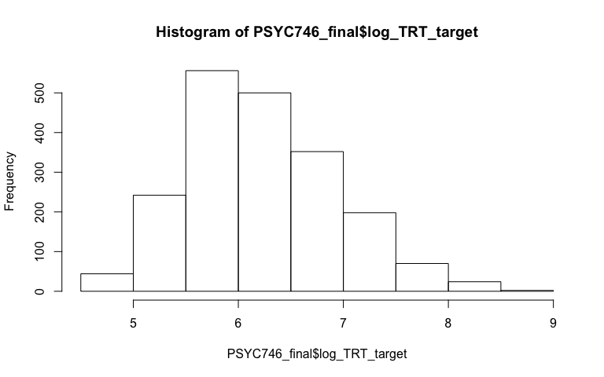<!-- -->

The DV is not perfectly normally distributed (skew to the right).

  - Relationship predictors & dependent
variable

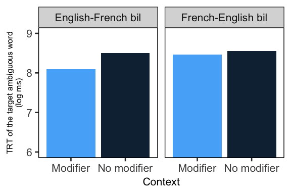<!-- -->

Target ambiguous words are read slower when there is no modifier,
although the difference between the modifier and the no modifier
condition is reduced for French-English bilingual older adults.

  - Correlation predictors & dependent variable

<!-- end list -->

``` r
PSYC746_final %>% 
  select(log_TRT_target, Group_dev, Context_dev) %>%
  cor()
```

    ##                log_TRT_target    Group_dev  Context_dev
    ## log_TRT_target      1.0000000  0.204573603 -0.138301158
    ## Group_dev           0.2045736  1.000000000 -0.002161634
    ## Context_dev        -0.1383012 -0.002161634  1.000000000

  - .20 correlation between Group and log TRT

  - \-.14 correlation between Context and log TRT

  - Individual scatterplots

**Effect of context by
participant**

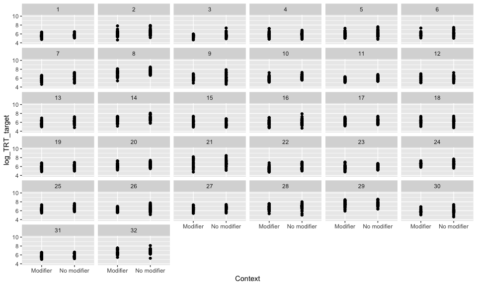<!-- -->

Most participants follow the expected pattern, in that they exhibit
faster log TRT when Context = Modifier. Some participants (e.g., 19) do
not seem to follow this pattern.

**Effect of context by
item**

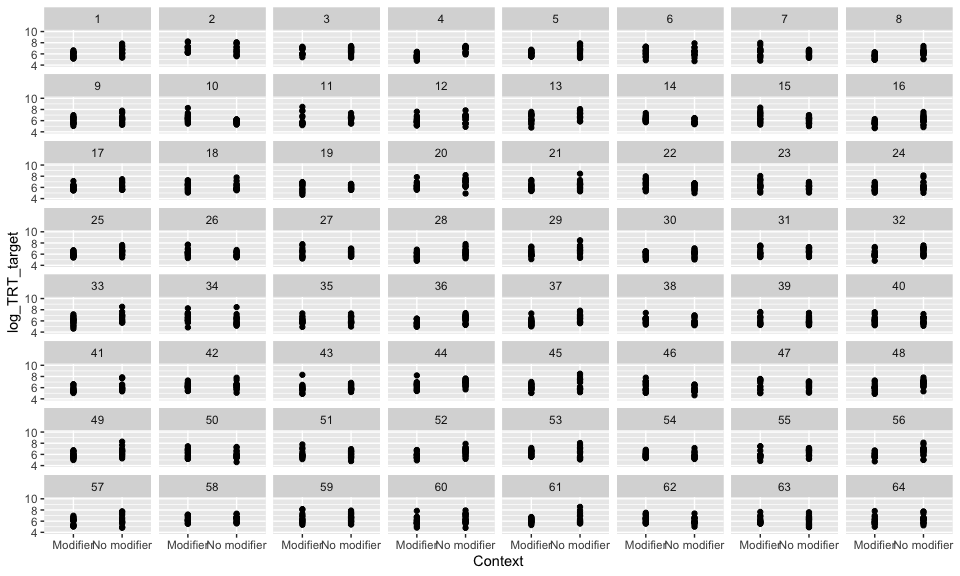<!-- -->

Most items follow the expected pattern, in that they are associated with
lower log TRT when a modifier related to one of their meanings is
present in the sentence. Not all items follow this pattern (item 2, item
50 for example).

**Effect of language group by
item**

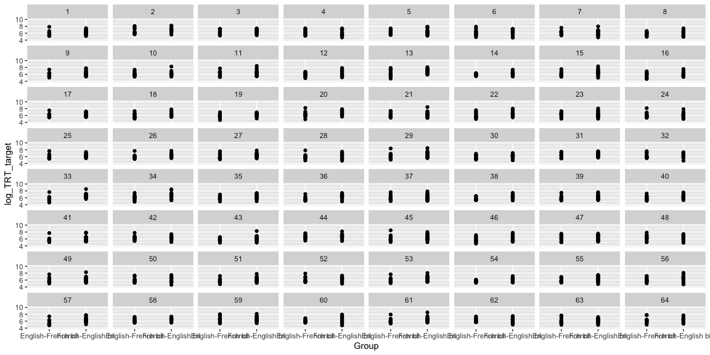<!-- -->

The pattern is unclear–it looks like some items, but not all, were read
faster by bilingual participants with English as their first language.

  - Regression line

**Context by
participant**

<!-- -->

At the subject level, a modifier in the sentence context (Context\_dev =
0.5) is associated with decreased log TRT.

**Context by
item**

<!-- -->

At the item level, it is less clear that a modifier in the sentence
context (Context\_dev = 0.5) is associated with decreased log TRT (some
items are associated with higher log TRT in such sentence contexts.

**Language group by
item**

<!-- -->

Items are associated with increased log TRT when they are read by
French-English bilingual participants (Group\_dev = 0.5).

# <span style="color: purple;">5. Models and interpretation</span>

## a. Model 1 (null)

### Equation

The equation for a cross-classified model is different from the usual
MLM equation. Below, we spelled out all the terms.

  - L1: TRTi(j1k1) = 𝜋0(j1k1) + ei(j1k1)
  - L2: 𝜋0(j1k1) = 𝜃000 + b0j10 + c00k1

We estimate 4 parameters (1 fixed effect, 3 random effects) with this
null model. Level 1 is the trial level \* TRTi(j1k1) is the TRT of the
trial for item j1 and participant k1 \* 𝜋0(j1k1) is the expected value
for TRT for this item and this participant \* ei(j1k1) is the error
term, which accounts for error for variability with respect to
participant and item level

Level2 is the cluster level: there are two distinct clusters, such that
trials are grouped both under participants and under items.

  - 𝜋0(j1k1) is the expected value for TRT, that can vary across
    participants and items, which allows the total variance of the model
    to be partitioned into that attributable to participants and items

  - 𝜃000 is the grand mean for TRT, averaged across all items and
    participants

  - b0j10 is the residual of the item j1 averaged across all
    participants (i.e., the difference between the grand mean and the
    TRT of target j1), which has variance tb00 \* \* c00k1 is the
    residual of participant k1 averaged across all items (i.e., the
    difference between the grand mean and the TRT of participant k1),
    which has variance tc00

  - *Usually, cross-classified MLM also include another term, d0(j1k1),
    which is the interaction between item and participant variance in
    the model. However, to be able to estimate the random effect
    associated with this interaction requires repeated reading of a
    single item by each participant, in order to separate the variance
    associated with this interaction from the residual variance. In the
    present study, each participant read each item only once, so we are
    unable to estimate this component and it is fixed to zero (not
    estimated). We have therefore only have three variance terms in the
    model: variance across items, variance across participants, and
    variance of the L1 error term
ei(j1k1).*

### Model

``` r
Null = lmer(log_TRT_target ~ 1+(1|Subject) + (1|ITEM), data=PSYC746_final, REML = T)
summary(Null)
```

    ## Linear mixed model fit by REML. t-tests use Satterthwaite's method [
    ## lmerModLmerTest]
    ## Formula: log_TRT_target ~ 1 + (1 | Subject) + (1 | ITEM)
    ##    Data: PSYC746_final
    ## 
    ## REML criterion at convergence: 3298.2
    ## 
    ## Scaled residuals: 
    ##     Min      1Q  Median      3Q     Max 
    ## -3.7257 -0.6292 -0.0159  0.6316  3.4981 
    ## 
    ## Random effects:
    ##  Groups   Name        Variance Std.Dev.
    ##  ITEM     (Intercept) 0.02596  0.1611  
    ##  Subject  (Intercept) 0.20575  0.4536  
    ##  Residual             0.27660  0.5259  
    ## Number of obs: 1988, groups:  ITEM, 64; Subject, 32
    ## 
    ## Fixed effects:
    ##             Estimate Std. Error       df t value            Pr(>|t|)    
    ## (Intercept)  6.22055    0.08351 34.84286   74.48 <0.0000000000000002 ***
    ## ---
    ## Signif. codes:  0 '***' 0.001 '**' 0.01 '*' 0.05 '.' 0.1 ' ' 1

### Interpretation

``` r
exp(6.22055)
```

    ## [1] 502.9798

Interpretation: The fixed effects table indicates that the expected
average value for TRT, across all participants and items, is 6.22055 log
ms, so 502.9798 ms. Notice that, in the random effects table, three
random effects can be found: the random intercept for ITEM, the random
intercept for Subject, and the residuals. Observation of these residuals
suggests that an important amount of participant variability, and a
reduced amount of item variability. This contrast is not surprising, and
it is found commonly in psycholinguistic research–items were strictly
controlled for a range of factors that impact reading time, such as
length and frequency, among others, thereby reducing variability in
reading times across items.

In what follows, we explore how important the clusters are in the MLM.

### Exploration of the random effects

#### Participants

We first calculate the Intra-Class Correlation, in order to assess the
proportion of variance that is explained by the clusters. The ICC is
calculated slightly differently in a cross-classified MLM compared to a
regular MLM, as it takes into account the presence of two clusters in
the model. The ICC in a cross-classified data structure is calculated by
dividing the random effect (by participant or by items) by the total
variance (by participant + by item + residuals) (see Carson & Beeson,
2013; Locker et al., 2007).

``` r
(0.20575)/(0.20575+0.02596+0.27660)
```

    ## [1] 0.4047727

40.48% of the total variance is explained by between-subject
variability.

We then calculate the Design effect to assess whether a cluster effect
is present for participants.

We first calculate the mean number of observation per participant

``` r
x = as.data.frame(table(PSYC746_final$Subject))
mean(x$Freq)
```

    ## [1] 62.125

Mean number of observations per participant = 62.125

``` r
DEFF = 1+(62.125-1)*0.4047727
```

DEFF participants = 25.742

Because this number is much higher than 1, it suggests an important
cluster effect for participants.

Effective sample size

``` r
32/25.742
```

    ## [1] 1.243105

The effective sample size, when adjusted for participant clustering, is
1.243. This suggests high within-participant consistency in terms of
reading times.

We then calculate the DEFT, in order to get a sense of how off our
standard error estimate would be in linear model that would not include
clustering.

``` r
DEFT = sqrt(DEFF)
```

Standard errors are 5.074 times larger than we would estimate in a
linear model that would not include clustering.

#### Items

We first calculate the ICC for the item cluster.

``` r
(0.02596)/(0.02596+0.20575+0.27660)
```

    ## [1] 0.0510712

5.11% of the total variance is explained by between-item variability.
40.48%

We then calculate the Design effect to assess whether a cluster effect
is present for items. We first calculate the mean number of observations
per item.

``` r
x = as.data.frame(table(PSYC746_final$ITEM))
mean(x$Freq)
```

    ## [1] 31.0625

Mean number of observations per item = 31.063

``` r
DEFF2 = 1+0.0510712*(31.063-1)
```

DEFF items = 2.535 Because this number is higher than 1, it suggests
that there is a cluster effect for items.

Effective sample size

``` r
64/2.535
```

    ## [1] 25.24655

The effective sample size, when adjusted for participant clustering, is
25.247.

We then calculate the DEFT, in order to get a sense of how off our
standard error estimate would be in a linear model that would not
include clustering.

``` r
DEFT2 = sqrt(DEFF2)
```

Standard errors are 1.592 times larger than we would estimate in a
linear model that would not include clustering.

Overall, these scores warrant the use of a MLM for this dataset. We
therefore continue our analysis by adding a level-2 predictor to the
null model.

## Model 2

### Equation

  - L1: TRTi(j1k1) = 𝜋0(j1k1) + ei(j1k1)
  - L2: 𝜋0(j1k1) = 𝜃000 + 𝜃001Contextj+ b0j10 + c00k1

In this model, we include the effects-coded level-2 predictor
“Context\_dev”, capturing the difference between embedding sentence
contexts with or without a modifier related to one of the homonym’s
meanings (e.g., Mary liked the fresh sage). This is represented by the
parameter 𝜃001Contextj. Thus, we estimate 5 parameters in this model (2
fixed effects, 3 random effects). This model allows us to answer
question a) Do bilingual older adults process ambiguous words
differently when they are embedded in sentences that clarify their
meaning or not?

### Model

``` r
Model2 = lmer(log_TRT_target ~ Context_dev +
                (1|Subject) + 
                (1|ITEM), data=PSYC746_final, REML = T)
summary(Model2)
```

    ## Linear mixed model fit by REML. t-tests use Satterthwaite's method [
    ## lmerModLmerTest]
    ## Formula: log_TRT_target ~ Context_dev + (1 | Subject) + (1 | ITEM)
    ##    Data: PSYC746_final
    ## 
    ## REML criterion at convergence: 3237.2
    ## 
    ## Scaled residuals: 
    ##     Min      1Q  Median      3Q     Max 
    ## -3.5837 -0.6392 -0.0200  0.6415  3.3714 
    ## 
    ## Random effects:
    ##  Groups   Name        Variance Std.Dev.
    ##  ITEM     (Intercept) 0.02621  0.1619  
    ##  Subject  (Intercept) 0.20535  0.4532  
    ##  Residual             0.26718  0.5169  
    ## Number of obs: 1988, groups:  ITEM, 64; Subject, 32
    ## 
    ## Fixed effects:
    ##               Estimate Std. Error         df t value             Pr(>|t|)    
    ## (Intercept)    6.22001    0.08343   34.89361   74.55 < 0.0000000000000002 ***
    ## Context_dev   -0.19192    0.02329 1901.90001   -8.24 0.000000000000000317 ***
    ## ---
    ## Signif. codes:  0 '***' 0.001 '**' 0.01 '*' 0.05 '.' 0.1 ' ' 1
    ## 
    ## Correlation of Fixed Effects:
    ##             (Intr)
    ## Context_dev 0.001

``` r
exp(6.22001)
```

    ## [1] 502.7083

### Interpretation

Remember that the predictor “Context\_dev” is effects-coded (-.5 = no
modifier, .5 = modifier present). The fixed effects table indicates that
the expected average value for TRT across all participants and items,
when Context\_dev is at 0 (i.e., while controlling for sentence
context), is 6.22001 log ms, so 502.7083 ms. There is a significant
negative effect of Context\_dev on expected TRT, suggesting that
homonyms embedded in sentence contexts with a modifier related to one of
their target meanings are read faster than compared to the average
reading speed across both sentence contexts. In the next section, we
plotted this effect. Observation of this plot suggests that bilingual
older adults do process ambiguous words differently when they are
embedded in sentences that include a modifier clarifying their
meaning.

### Visualization of the effect

<!-- -->

In order to reduce the length of this demo, we did not run additional
checks on this model. However, we fully check model assumptions for
model 3, our last model, and compare it to Model 2 and the null model in
terms of fit.

## Model 3

### Equation

  - L1: TRTi(j1k1) = 𝜋0(j1k1) + ei(j1k1)
  - L2: 𝜋0(j1k1) = 𝜃000 + b0j10 + c00k1 + 𝜃001Contextj + 𝜃002Language
    groupk + c10k1 + 𝜃002Language groupk x 𝜃002Contextj

We estimate 8 parameters in this model (4 fixed effects, 4 random
effects). This model includes a novel level 2 predictor for language
group, capturing the difference between participants with English as
their first vs. second language, represented by parameter 𝜃002Language
groupk. We also added a random slope for Context\_dev by participant, in
order to assess whether the effect of context varies across
participants, represented by parameter c10k1. Because we were interested
in how the effect of sentence context depended on the effect of language
group, we also included the interaction of these two predictors,
represented by parameter 𝜃002Language groupk x 𝜃002Contextj.

Adding these parameters allows us to answer questions b), c) and d). b)
Does the effect of context vary across participants? c) Does native
language modulate the processing of ambiguous words? d) Does context
impact the processing of ambiguous words regardless of native language?

### Model

``` r
Model3 = lmer(log_TRT_target ~ Context_dev*Group_dev+
                (1+Context_dev||Subject) + 
                (1|ITEM), data=PSYC746_final, REML = T)
summary(Model3)
```

    ## Linear mixed model fit by REML. t-tests use Satterthwaite's method [
    ## lmerModLmerTest]
    ## Formula: log_TRT_target ~ Context_dev * Group_dev + (1 + Context_dev ||  
    ##     Subject) + (1 | ITEM)
    ##    Data: PSYC746_final
    ## 
    ## REML criterion at convergence: 3235.6
    ## 
    ## Scaled residuals: 
    ##     Min      1Q  Median      3Q     Max 
    ## -3.6515 -0.6410 -0.0236  0.6468  3.3326 
    ## 
    ## Random effects:
    ##  Groups    Name        Variance Std.Dev.
    ##  ITEM      (Intercept) 0.026274 0.1621  
    ##  Subject   Context_dev 0.001971 0.0444  
    ##  Subject.1 (Intercept) 0.190874 0.4369  
    ##  Residual              0.266246 0.5160  
    ## Number of obs: 1988, groups:  ITEM, 64; Subject, 32
    ## 
    ## Fixed effects:
    ##                       Estimate Std. Error       df t value             Pr(>|t|)
    ## (Intercept)            6.19294    0.08204 33.91029  75.483 < 0.0000000000000002
    ## Context_dev           -0.20025    0.02493 29.17057  -8.033        0.00000000707
    ## Group_dev              0.28966    0.15901 30.00768   1.822               0.0785
    ## Context_dev:Group_dev  0.09712    0.04972 28.96251   1.953               0.0605
    ##                          
    ## (Intercept)           ***
    ## Context_dev           ***
    ## Group_dev             .  
    ## Context_dev:Group_dev .  
    ## ---
    ## Signif. codes:  0 '***' 0.001 '**' 0.01 '*' 0.05 '.' 0.1 ' ' 1
    ## 
    ## Correlation of Fixed Effects:
    ##             (Intr) Cntxt_ Grp_dv
    ## Context_dev  0.001              
    ## Group_dev   -0.181  0.000       
    ## Cntxt_dv:G_  0.000 -0.175  0.001

``` r
exp(6.19294)
```

    ## [1] 489.2825

#### Interpretation

Inspection of the fixed effect table indicates that the expected value
for log TRT when Context and Group are at 0 (i.e., for both sentence
context type and both language groups), is 6.19294 log ms, so
489.2825ms. As in Model 2, there is a significant negative effect of
context on expected TRT, suggesting that homonyms embedded in sentence
contexts with a modifier related to one of their target meanings are
read faster than compared to the average reading speed across both
sentence contexts. The effect of language group does not reach
significance, suggesting no difference of French-English bilinguals, in
terms of Log TRT, from the grand mean log TRT of the two language
groups. This indicates that native language does not modulate the
processing of ambiguous words (question c). The interaction of language
group and context also does not reach significance, suggesting that
context does impacts the processing of ambiguous words regardless of
native language (question d), as can be seen in the bar plot
below.

#### Visualization of the interaction (non-significant)

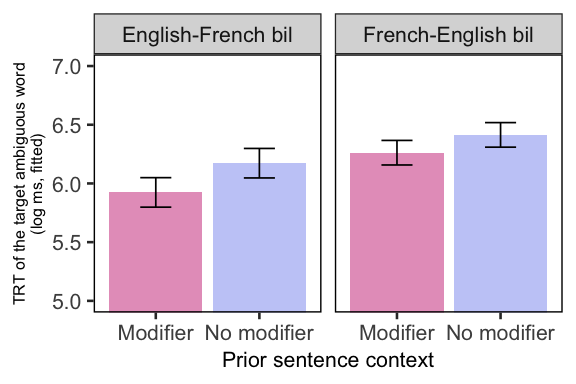<!-- -->

#### 95% plausible values range for intercepts

##### How much do means vary across participants?

``` r
SDx2 <- (2*(sqrt(0.190874)))
Upper_range <- 6.19294 + SDx2
lower_range <- 6.19294 - SDx2
```

The 95% plausible values range for participants means is 5.319-7.067 log
ms.

##### How much do means vary across items?

``` r
SDx2 <- (2*(sqrt(0.026274)))
Upper_range <- 6.19294 + SDx2
lower_range <- 6.19294 - SDx2
```

The 95% plausible values range for items means is 5.869-6.517 log ms.
The smaller plausible value range for items means compared to
participants means was expected, as items were strictly controlled.

### Model comparison

#### Deviance tests

``` r
anova(Model2, Model3, refit = FALSE)
```

    ## Data: PSYC746_final
    ## Models:
    ## Model2: log_TRT_target ~ Context_dev + (1 | Subject) + (1 | ITEM)
    ## Model3: log_TRT_target ~ Context_dev * Group_dev + (1 + Context_dev || 
    ## Model3:     Subject) + (1 | ITEM)
    ##        Df    AIC    BIC  logLik deviance  Chisq Chi Df Pr(>Chisq)
    ## Model2  5 3247.2 3275.1 -1618.6   3237.2                         
    ## Model3  8 3251.6 3296.4 -1617.8   3235.6 1.5249      3     0.6765

Model 3 is not superior to Model 2 in terms of fit (X2(3) = 1.524, p \>
.05). The Log likelihood of Model 2 and Model 3 are similar.

``` r
anova(Null, Model2, refit = FALSE)
```

    ## Data: PSYC746_final
    ## Models:
    ## Null: log_TRT_target ~ 1 + (1 | Subject) + (1 | ITEM)
    ## Model2: log_TRT_target ~ Context_dev + (1 | Subject) + (1 | ITEM)
    ##        Df    AIC    BIC  logLik deviance  Chisq Chi Df           Pr(>Chisq)    
    ## Null    4 3306.2 3328.6 -1649.1   3298.2                                       
    ## Model2  5 3247.2 3275.1 -1618.6   3237.2 61.064      1 0.000000000000005525 ***
    ## ---
    ## Signif. codes:  0 '***' 0.001 '**' 0.01 '*' 0.05 '.' 0.1 ' ' 1

Model 2 is superior to the null model in terms of fit (X2(1) = 61.064, p
\< .001).

#### Profile confidence intervals

``` r
confint(Model3, oldNames = FALSE) 
```

    ## Computing profile confidence intervals ...

    ##                                 2.5 %     97.5 %
    ## sd_(Intercept)|ITEM     0.12801983585  0.2046176
    ## sd_Context_dev|Subject  0.00000000000  0.1166254
    ## sd_(Intercept)|Subject  0.33507168177  0.5552452
    ## sigma                   0.49984998818  0.5330104
    ## (Intercept)             6.03254634210  6.3533525
    ## Context_dev            -0.24896181007 -0.1514471
    ## Group_dev              -0.02176418721  0.6009623
    ## Context_dev:Group_dev  -0.00006391184  0.1944441

The profile confidence interval for language group, context\*language
group, and for the random slope for context by subject all include 0.
This suggests that these predictors and the random slope do not
contribute significantly to the model and allows us to answer “no” to
question b (Does the effect of context vary across participants?). These
results are also in line with the results of model comparison
above–model 2, which does not include these parameters, does not have
a worse fit than model 3 (but has better fit than the null model).

#### Difference in residuals

Model comparison suggests that Model 2 is superior to Model 3 in terms
of fit. We now compare the residuals of Model 2 and 3.

``` r
tau2change_p = 0.20535-0.190874
```

.014

``` r
tau2change_i = 0.02621-0.026274
```

\-.000

``` r
sigma2change = 0.26718-0.266246
```

.001

Adding the language group predictor, the interaction between language
group and context, and the random slope for context by participant does
not really impact the residuals.

#### Variance reduction

We now assess by how much variance at level 1 and 2 is reduced in Model
3 compared to Model 2.

``` r
L1_var_reduction <- sigma2change/0.26718
```

.003

``` r
L2_var_reduction_p <- tau2change_p/0.20535
```

.070

``` r
L2_var_reduction_i <- tau2change_i/0.02621
```

\-.002

Adding the language group predictor, the interaction between language
group and context, and the random slope for context by participant
slightly reduces the variance explained by participant variability
(-7%).

#### Conditional ICC

We now calculate the change in ICC caused by the addition of predictors
and the random slope.

``` r
conditionalICC_p = 0.190874/ (0.190874 + 0.026274+0.266246)
conditionalICC_i = 0.026274 / (0.026274 + 0.190874+ 0.266246)
```

In Model 3, 39.49% of the total variance is due to variability between
subjects and 5.44% of the variance is due to variability between items.
As a reminder, the ICC of the null model suggested that 40.48% of the
total variance was due to variability between subjects and 5.11% of the
total variance was explained by between-item variability. Therefore,
Model 3 is associated with a slight decrease in the ICC by participant,
and a slight increase of the ICC by
item.

### Assumption checks

#### Distribution of L1 residuals

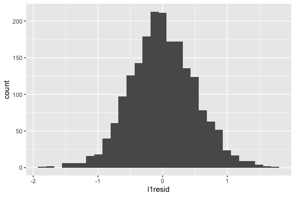<!-- -->

L1 residuals look fairly
normal.

#### Distribution of L2 residuals

<!-- -->

There is a potential violation of the assumption of normality of
residuals. There are two participants that should be flagged as
outliers, and potentially one item that should be flagged as an outlier.

This is confirmed by the plots of the L2 residuals below

**L2 residuals-participants
(intercept)**

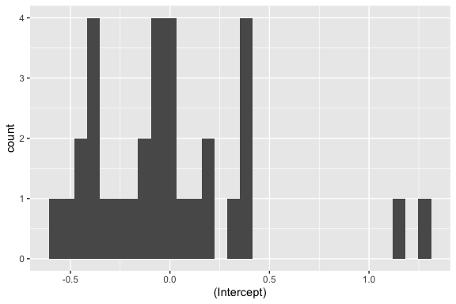<!-- -->

**L2 residuals - Items
(intercept)**

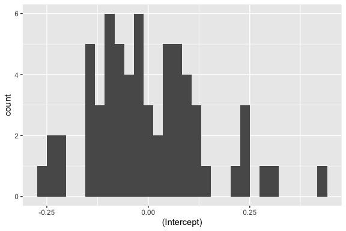<!-- -->

**L2 residuals - Participants
(slope)**

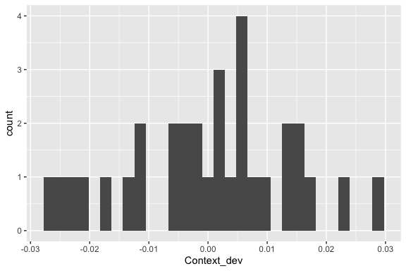<!-- -->

#### Summary statistics L2 residuals

``` r
summary(PSYC746_finalByParticRanef)
```

    ##     Min.  1st Qu.   Median     Mean  3rd Qu.     Max. 
    ## -0.60671 -0.34263 -0.03451  0.00000  0.18721  1.24930

``` r
summary(PSYC746_finalByParticRanef_slope)
```

    ##      Min.   1st Qu.    Median      Mean   3rd Qu.      Max. 
    ## -0.026279 -0.007621  0.001885  0.000000  0.008702  0.029309

``` r
summary(PSYC746_finalByItemRanef)
```

    ##     Min.  1st Qu.   Median     Mean  3rd Qu.     Max. 
    ## -0.25303 -0.09670 -0.02187  0.00000  0.07893  0.43761

All L2 residuals have a mean of 0 but their median is not 0, which
suggests some nonnormality in their
distribution.

#### Flag outliers-participants (intercept)

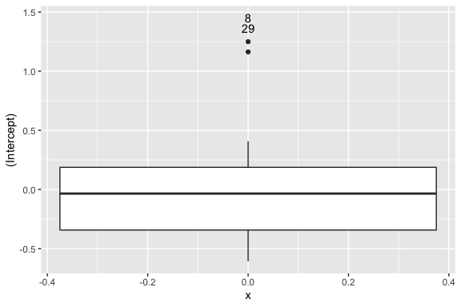<!-- -->

Participant 29 and 8 are
outliers.

#### Flag outliers-items (intercept)

<!-- -->

Item 2 is an outlier (this item is the word
“axes”).

#### Flag outliers-participants (slope)

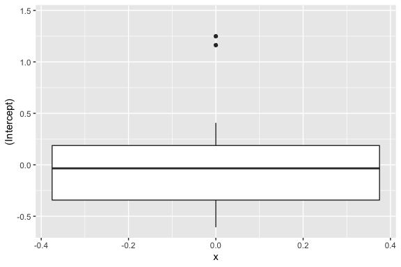<!-- -->

No outlier flagged.

##### As an aside, what if we removed these outliers?

Removing both participants and item outliers creates a convergence issue
(remember that our sample size is small to begin with). Thus, we first
tried removing participants 8 and
29.

``` r
Model3bis <- update(Model3, . ~ ., data=filter(PSYC746_final, Subject != c(8, 29)))
summary(Model3bis)
```

    ## Linear mixed model fit by REML. t-tests use Satterthwaite's method [
    ## lmerModLmerTest]
    ## Formula: log_TRT_target ~ Context_dev + Group_dev + (1 | Subject) + (0 +  
    ##     Context_dev | Subject) + (1 | ITEM) + Context_dev:Group_dev
    ##    Data: filter(PSYC746_final, Subject != c(8, 29))
    ## 
    ## REML criterion at convergence: 3109.3
    ## 
    ## Scaled residuals: 
    ##     Min      1Q  Median      3Q     Max 
    ## -3.7157 -0.6420 -0.0290  0.6425  3.3544 
    ## 
    ## Random effects:
    ##  Groups    Name        Variance Std.Dev.
    ##  ITEM      (Intercept) 0.026040 0.16137 
    ##  Subject   Context_dev 0.002188 0.04678 
    ##  Subject.1 (Intercept) 0.190004 0.43589 
    ##  Residual              0.262496 0.51234 
    ## Number of obs: 1924, groups:  ITEM, 64; Subject, 32
    ## 
    ## Fixed effects:
    ##                       Estimate Std. Error       df t value             Pr(>|t|)
    ## (Intercept)            6.19333    0.08189 33.25045  75.629 < 0.0000000000000002
    ## Context_dev           -0.19320    0.02534 28.84832  -7.625         0.0000000216
    ## Group_dev              0.26808    0.15874 29.44744   1.689               0.1018
    ## Context_dev:Group_dev  0.09290    0.05056 28.53370   1.837               0.0766
    ##                          
    ## (Intercept)           ***
    ## Context_dev           ***
    ## Group_dev                
    ## Context_dev:Group_dev .  
    ## ---
    ## Signif. codes:  0 '***' 0.001 '**' 0.01 '*' 0.05 '.' 0.1 ' ' 1
    ## 
    ## Correlation of Fixed Effects:
    ##             (Intr) Cntxt_ Grp_dv
    ## Context_dev  0.001              
    ## Group_dev   -0.182  0.000       
    ## Cntxt_dv:G_  0.000 -0.178  0.001

Removing outlier participants does not drastically change the effects:
the effect of language Group, which did not reach significance in Model
3 (p = .06) is now at .10. The interaction coefficient is similar to the
one in Model 3, and it still does not reach significance.

We also tried removing the outlier
item.

``` r
Model3bis <- update(Model3, . ~ ., data=filter(PSYC746_final, ITEM != 2))
summary(Model3bis)
```

    ## Linear mixed model fit by REML. t-tests use Satterthwaite's method [
    ## lmerModLmerTest]
    ## Formula: log_TRT_target ~ Context_dev + Group_dev + (1 | Subject) + (0 +  
    ##     Context_dev | Subject) + (1 | ITEM) + Context_dev:Group_dev
    ##    Data: filter(PSYC746_final, ITEM != 2)
    ## 
    ## REML criterion at convergence: 3180.9
    ## 
    ## Scaled residuals: 
    ##     Min      1Q  Median      3Q     Max 
    ## -3.6333 -0.6499 -0.0262  0.6357  3.3092 
    ## 
    ## Random effects:
    ##  Groups    Name        Variance Std.Dev.
    ##  ITEM      (Intercept) 0.021298 0.14594 
    ##  Subject   Context_dev 0.002967 0.05447 
    ##  Subject.1 (Intercept) 0.189108 0.43487 
    ##  Residual              0.266163 0.51591 
    ## Number of obs: 1959, groups:  ITEM, 63; Subject, 32
    ## 
    ## Fixed effects:
    ##                       Estimate Std. Error       df t value             Pr(>|t|)
    ## (Intercept)            6.18389    0.08126 33.23636  76.098 < 0.0000000000000002
    ## Context_dev           -0.19988    0.02573 29.09311  -7.770         0.0000000141
    ## Group_dev              0.28870    0.15831 30.00544   1.824               0.0782
    ## Context_dev:Group_dev  0.09423    0.05132 28.88887   1.836               0.0766
    ##                          
    ## (Intercept)           ***
    ## Context_dev           ***
    ## Group_dev             .  
    ## Context_dev:Group_dev .  
    ## ---
    ## Signif. codes:  0 '***' 0.001 '**' 0.01 '*' 0.05 '.' 0.1 ' ' 1
    ## 
    ## Correlation of Fixed Effects:
    ##             (Intr) Cntxt_ Grp_dv
    ## Context_dev  0.001              
    ## Group_dev   -0.182  0.000       
    ## Cntxt_dv:G_  0.000 -0.176  0.001

Removing this item does not significantly impact the effects observed in
Model 3.

#### Relatedness

In what follows, we checked whether: \* L2 predictors were unrelated to
L2 residuals \* L2 predictors were not related to L1 residuals \* L2
residuals were unrelated to L1 residuals \* L2 residuals were
independent from one another and across L2 units

##### Relatedness of L2 predictors and L2 residuals

*Relatedness of L2 predictors (context) and L2 residuals (intercept
participant)*
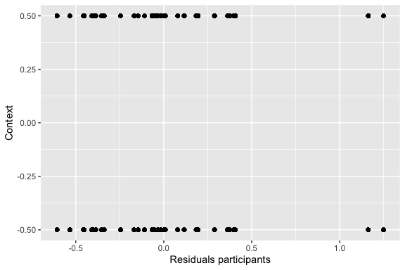<!-- -->

    ## 
    ##  Pearson's product-moment correlation
    ## 
    ## data:  l2_mix$L2resid_p and l2_mix$Context_dev
    ## t = -0.21112, df = 1986, p-value = 0.8328
    ## alternative hypothesis: true correlation is not equal to 0
    ## 95 percent confidence interval:
    ##  -0.04869021  0.03923392
    ## sample estimates:
    ##          cor 
    ## -0.004737297

There is no significant correlation between L2 residuals by participant
and Context.

*Relatedness of L2 predictors (group) and L2 residuals (intercept
participant)*
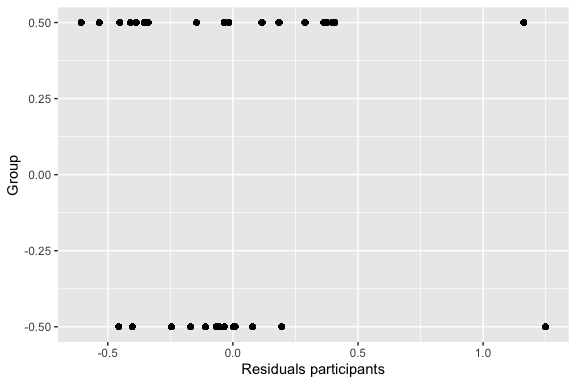<!-- -->

    ## 
    ##  Pearson's product-moment correlation
    ## 
    ## data:  l2_mix$L2resid_p and l2_mix$Group_dev
    ## t = 0.29161, df = 1986, p-value = 0.7706
    ## alternative hypothesis: true correlation is not equal to 0
    ## 95 percent confidence interval:
    ##  -0.03743044  0.05049190
    ## sample estimates:
    ##         cor 
    ## 0.006543379

There is no significant correlation between L2 residuals by participant
and Language Group.

*Relatedness of L2 predictor (context) and L2 residuals (intercept
items)*
<!-- -->

    ## 
    ##  Pearson's product-moment correlation
    ## 
    ## data:  l2_mix$L2resid_i and l2_mix$Context_dev
    ## t = 0.028594, df = 1986, p-value = 0.9772
    ## alternative hypothesis: true correlation is not equal to 0
    ## 95 percent confidence interval:
    ##  -0.04332264  0.04460342
    ## sample estimates:
    ##          cor 
    ## 0.0006416285

There is no significant correlation between L2 residuals by item and
Context.

*Relatedness of L2 predictors (group) and L2 residuals (intercept
items)*
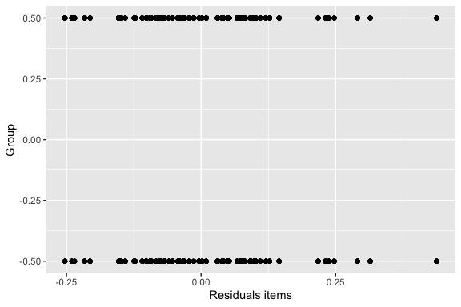<!-- -->

    ## 
    ##  Pearson's product-moment correlation
    ## 
    ## data:  l2_mix$L2resid_i and l2_mix$Group_dev
    ## t = -0.088875, df = 1986, p-value = 0.9292
    ## alternative hypothesis: true correlation is not equal to 0
    ## 95 percent confidence interval:
    ##  -0.04595331  0.04197244
    ## sample estimates:
    ##          cor 
    ## -0.001994293

There is no significant correlation between L2 residuals by item and
Language Group.

*Relatedness of L2 predictor (context) and L2 residuals (slope context
participant)*
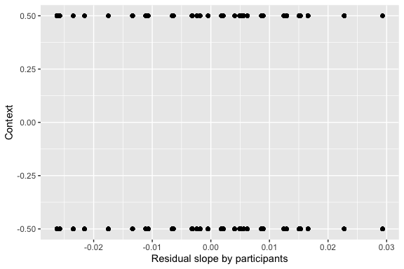<!-- -->

    ## 
    ##  Pearson's product-moment correlation
    ## 
    ## data:  l2_mix$L2resid_slope and l2_mix$Context_dev
    ## t = 0.1376, df = 1986, p-value = 0.8906
    ## alternative hypothesis: true correlation is not equal to 0
    ## 95 percent confidence interval:
    ##  -0.04088090  0.04704436
    ## sample estimates:
    ##         cor 
    ## 0.003087701

There is no significant correlation between L2 residuals (random slope
for Context by participants) and Context.

*Relatedness of L2 predictor (group) and L2 residuals (slope context
participant)*
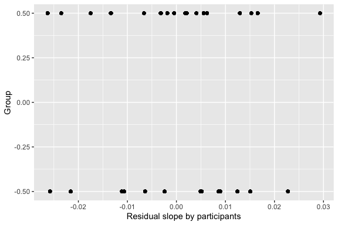<!-- -->

    ## 
    ##  Pearson's product-moment correlation
    ## 
    ## data:  l2_mix$L2resid_slope and l2_mix$Group_dev
    ## t = -0.18833, df = 1986, p-value = 0.8506
    ## alternative hypothesis: true correlation is not equal to 0
    ## 95 percent confidence interval:
    ##  -0.04817999  0.03974454
    ## sample estimates:
    ##          cor 
    ## -0.004225892

There is no significant correlation between L2 residuals (random slope
for Context by participants) and Language Group.

##### Relatedness of L2 predictors and L1 residuals

*Relatedness of L2 predictors (context) and L1 residuals*
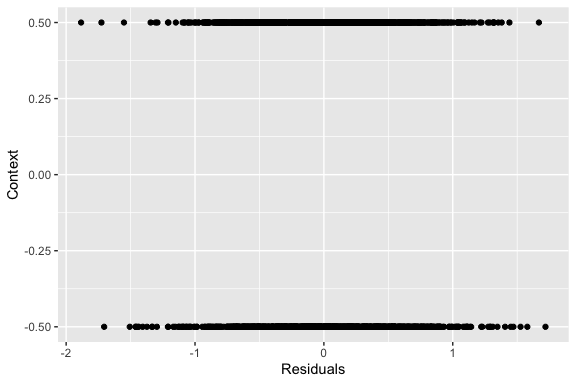<!-- -->

    ## 
    ##  Pearson's product-moment correlation
    ## 
    ## data:  PSYC746_final$l1resid and PSYC746_final$Context_dev
    ## t = 0.0000000000000028608, df = 1986, p-value = 1
    ## alternative hypothesis: true correlation is not equal to 0
    ## 95 percent confidence interval:
    ##  -0.04396305  0.04396305
    ## sample estimates:
    ##                       cor 
    ## 0.00000000000000006419341

There is no significant correlation between L1 residuals and Context.

*Relatedness of L2 predictors (group) and L1 residuals*
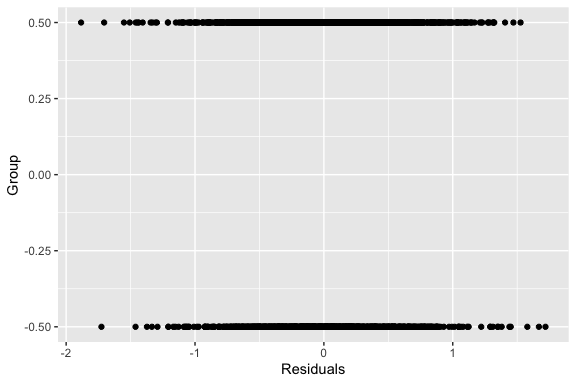<!-- -->

    ## 
    ##  Pearson's product-moment correlation
    ## 
    ## data:  PSYC746_final$l1resid and PSYC746_final$Group_dev
    ## t = -0.00000000000010667, df = 1986, p-value = 1
    ## alternative hypothesis: true correlation is not equal to 0
    ## 95 percent confidence interval:
    ##  -0.04396305  0.04396305
    ## sample estimates:
    ##                      cor 
    ## -0.000000000000002393582

There is no significant correlation between L1 residuals and Language
Group.

##### Relatedness of L1 and L2 residuals

*Relatedness of L1 residuals and L2 residuals (intercept participants)*
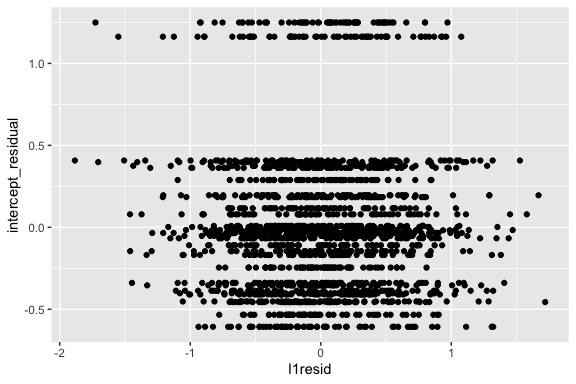<!-- -->

    ## 
    ##  Pearson's product-moment correlation
    ## 
    ## data:  PSYC746_final$l1resid and PSYC746_final$intercept_residual
    ## t = 0.82578, df = 1986, p-value = 0.409
    ## alternative hypothesis: true correlation is not equal to 0
    ## 95 percent confidence interval:
    ##  -0.02545703  0.06243895
    ## sample estimates:
    ##        cor 
    ## 0.01852676

There is no significant correlation between L1 residuals and L2
residuals (random intercept by participant). Again, the two outliers are
clearly identifiable.

*Relatedness of L1 residuals and L2 residuals (intercept items)*
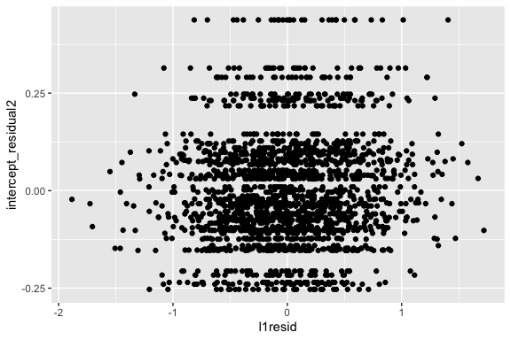<!-- -->

    ## 
    ##  Pearson's product-moment correlation
    ## 
    ## data:  PSYC746_final$l1resid and PSYC746_final$intercept_residual2
    ## t = 4.0633, df = 1986, p-value = 0.00005026
    ## alternative hypothesis: true correlation is not equal to 0
    ## 95 percent confidence interval:
    ##  0.04702612 0.13422867
    ## sample estimates:
    ##        cor 
    ## 0.09080145

There is a significant correlation between L1 residuals and the random
intercept by item, although the correlation is very close to 0 (p =
.09).

*Relatedness of l1\_residuals and l2\_rL1 duals (slope pL2 icipants)*
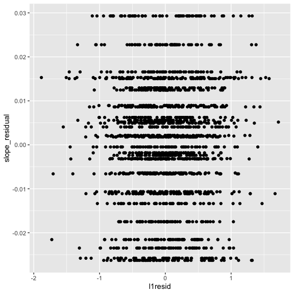<!-- -->

    ## 
    ##  Pearson's product-moment correlation
    ## 
    ## data:  PSYC746_final$l1resid and PSYC746_final$slope_residual
    ## t = -0.23665, df = 1986, p-value = 0.813
    ## alternative hypothesis: true correlation is not equal to 0
    ## 95 percent confidence interval:
    ##  -0.04926167  0.03866195
    ## sample estimates:
    ##          cor 
    ## -0.005310122

There is no significant correlation between L1 residuals and L2
residuals (random slope for Context by participant).

##### Relatedness L2 residuals and L2 residuals

**L2 intercept (participant)-L2 slope
(participants)**

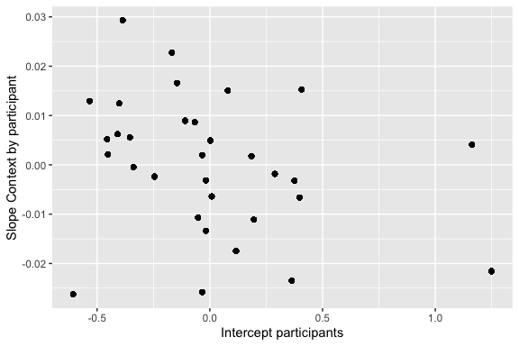<!-- -->

    ## 
    ##  Pearson's product-moment correlation
    ## 
    ## data:  l2_mix$L2resid_p and l2_mix$L2resid_slope
    ## t = -13.706, df = 1986, p-value < 0.00000000000000022
    ## alternative hypothesis: true correlation is not equal to 0
    ## 95 percent confidence interval:
    ##  -0.3336094 -0.2532677
    ## sample estimates:
    ##        cor 
    ## -0.2939577

There is a moderate negative correlation (significant), suggesting that
the higher the mean log TRT value for an individual (i.e., the slower
the individual), the smaller the effect of context for this individual.
This is a violation of the assumption of independence of errors.

**L2 intercept (participant)-L2 intercept
(item)**

<!-- -->

    ## 
    ##  Pearson's product-moment correlation
    ## 
    ## data:  l2_mix2$L2resid_p and l2_mix2$L2resid_i
    ## t = -0.081127, df = 1986, p-value = 0.9353
    ## alternative hypothesis: true correlation is not equal to 0
    ## 95 percent confidence interval:
    ##  -0.04577981  0.04214600
    ## sample estimates:
    ##          cor 
    ## -0.001820425

There is no correlation between the random intercept by participant and
the random intercept by item.

**L2 intercept (items)-L2 slope
(participants)**

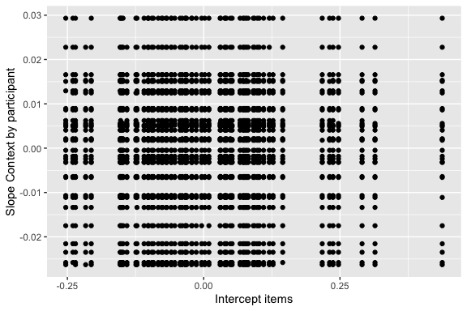<!-- -->

    ## 
    ##  Pearson's product-moment correlation
    ## 
    ## data:  l2_mix2$L2resid_i and l2_mix2$L2resid_slope
    ## t = 0.22506, df = 1986, p-value = 0.822
    ## alternative hypothesis: true correlation is not equal to 0
    ## 95 percent confidence interval:
    ##  -0.03892146  0.04900240
    ## sample estimates:
    ##         cor 
    ## 0.005050227

There is no correlation between the random intercept by item and the
random slope for Context by item.

# <span style="color: purple;">6. Conclusion</span>

In conclusion, we have found that bilingual older adults do process
ambiguous words differently when they are embedded in sentences that
include a modifier clarifying their meaning. This effect did not vary
significantly across participants. There was also no significant
difference in terms of processing speed between English-French and
French-English bilinguals. Whether English was the first or the second
language did not modulate the processing of ambiguous words. Finally,
the effect of sentence context did not vary across language groups,
suggesting that context does impacts the processing of ambiguous words
regardless of native language in bilingual older adults.

It should be noted that all participants were highly fluent in English,
which may partially explain the absence of native language effect.
However, the effects of native language and the interaction of native
language were both borderline approached significance, which suggests
that the study may have been underpowered (as a reminder, there were 32
participants).
